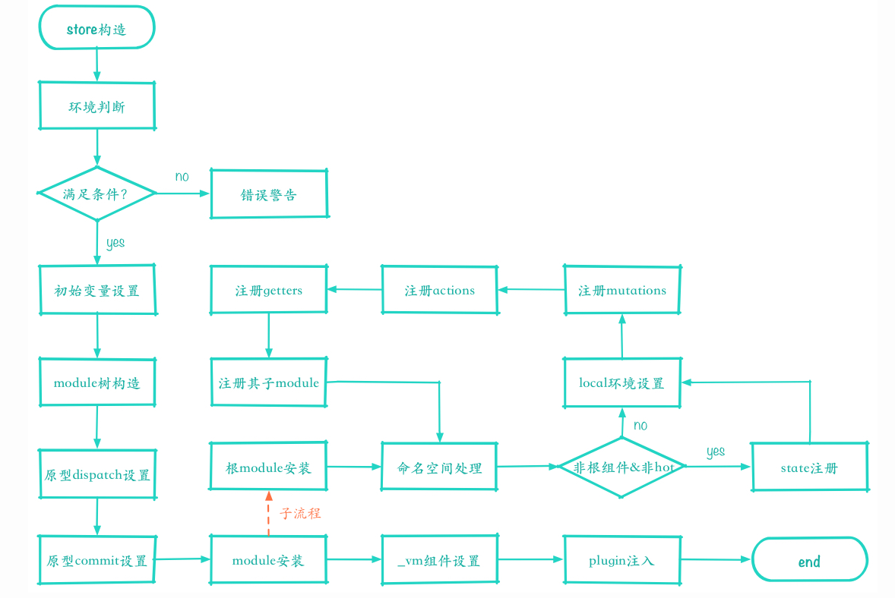

# Vuex

> 一个专为Vue.js应用程序开发的状态管理模式. 采用集中式存储管理应用的所有组件状态, 并以响应的规则保证状态以一种可预测的方式发生变化  


## 1. 核心概念
* State: Vuex的唯一数据源, 且数据是响应式的.
* Mutation: Vuex中更改`store`状态的唯一方法是`commit Mutation`, 只能包含同步操作
* Action: 用于提交`Mutation`, 可以包含异步操作
* Getter: 基于`state`派生出的一些状态
* Module: 将store分割成模块, 最后组合到一起.

## 2. 使用

* ### 最简单的store
```js
const store = new Vuex.Store({
    state: {
        count: 0
    }
    mutation: {
        increment(state) {
            state.count++
        }
    }
})
```
通过`store.state`来获取状态对象,以及通过`store.commit`方法来触发状态变更.
```js
store.commit('increment')

console.log(store.state.count)
```

* ### State

在Vue组件中获取Vuex的状态
```js
const Counter = {
    template: `<div>{{count}}</div>`,
    computed: {
        count() {
            return this.$store.state.count
        }
    }
}

const app = new Vue({
    store,
    components: {Counter},
    template:`
        <div>
            <counter />
        </div>
    `
}).mount('#app')
```
通过在根实例中注册store选项, 该store实例会注入到根组件下的所有子组件中, 在子组件中可通过`this.$store`访问.

* ### Getter
> 基于store中state衍生出的一些状态.

```js
const store = new Vuex.Store({
    state: {
        todos: [
            {id: 1, text: '', done: false},
            {id: 1, text: '', done: true}
        ]
    },
    getters: {
        doneTodos: state => {
            return state.todos.filter(todo => todo.done)
        }
    }
})
```
Getter会暴露为store.getters对象. 可通过`store.getters.doneTodos`访问.  同时getter也接受其他getter的作为第二个参数
```js
getters: {
    doneTodosCount: (state,getters) => {
        return getters.doneTodos.length
    }
}
```
可以很方便的在组件中使用
```js
computed: {
    doneTodosCount() {
        return this.$store.getters.doneTodosCount
    }
}
```
也可以通过让getter返回一个函数,来实现给getter传参. 这在对store里的数组进行查询的时候非常有用
```js
getters: {
    getTodoByID: (state) => (id) => {
        return state.todos.find(todo => todo.id === id)
    }
}

store.getters.getTodoByID(2)
```

* ### Mutation
> 更改Vuex store中的状态的唯一方法 -- 提交mutation
每个mutation都有一个字符串的事件类型和一个回调函数, 回调函数就是进行更改状态的地方. 并将state作为第一个参数
```js
const store = new Vuex.Store({
    state: {
        count: 1
    },
    mutation: {
        increment(state) {
            state.count++
        }
    }
})

store.commit('increment')
```
可以在提交mutation的时候传入额外的参数. 即载荷(payload), 应该是一个对象, 可以包含多个字段
:::tip
* 由于store中状态时响应式的, 我们在变更状态时, 监视状态的Vue组件也会自动更新. 意味着Mutation也需要遵守一些注意事项
    * 提前在store中初始化好所有所需属性
    * 当需要在对象中添加新属性时. 使用`Vue.set`, 或者使用新对象替代原对象.
* Mutation必须是同步函数
:::

* ### Action
> Action 类似于mutation, 不同的是. action是用来提交mutation的, 并且可以执行异步操作.

```js
const store = new Vuex.Store({
    state: {
        count: 0
    },
    mutations: {
        increment(state) {
            state.count++
        }
    },
    actions: {
        increment({commit}){
            commit('increment')
        }
    }
})
```
Action函数接收一个与store实例具有相同方法和属性的context对象  

在action内部执行异步操作, action也支持载荷,在组件中可以使用this.$store.dispatch('xx')分发action, 
```js
actions: {
    incrementAsync({commit}, payload) {
        setTimeout(()=> {
            commit('increment')
        }, 1000)
    }
}
```
action通常是异步的, store.dispatch可以处理action函数返回的Promise,并且store.dispatch仍旧返回Promise,一个store.dispatch

* ### Module
由于使用单一状态树, store可能会在应用复杂的时候变的臃肿. 为此, Vuex允许将store分割成模块, 每个模块拥有自己的state, mutation, action, getter
```js
const moduleA = {
  state: { ... },
  mutations: { ... },
  actions: { ... },
  getters: { ... }
}

const moduleB = {
  state: { ... },
  mutations: { ... },
  actions: { ... }
}

const store = new Vuex.Store({
  modules: {
    a: moduleA,
    b: moduleB
  }
})

store.state.a // -> moduleA 的状态
store.state.b // -> moduleB 的状态

```

* ### 辅助函数
    * mapState
    * mapGetters
    * mapMutations
    * mapActions

在组件中使用时`mapState`和`mapGetters`可以将store中的`state`和`getter`映射到局部计算属性`computed`.
```js
// 方式一
computed: mapState([
    // 映射this.count 为 store.state.count
    'count'
])
// 方式二
computed: mapState({
    // 箭头函数
    count: state => state.count,
    // 传字符串参数
    countAlias: 'count',
    // 在常规函数中可以使用this
    countPlusLocalState(state) {
        return state.count + this.localState
    }
})
// 方式三
computed: {
    ...mapState([
        'count'
    ])
}
```

在组件中使用时`mapMutations`和`mapActions`可以将store中的`mutation`和`action`映射到局部`methods`.

## 3. 原理

* ### install函数
> Vuex作为Vue的插件. 在使用之前需要调用`Vue.use`, `Vue.use`会触发`install函数`

首先,在install内部会进行判断是否已经安装了Vuex, 若未安装则会调用`applyMixin`, 通过`Vue.mixin({beforeCreate: vueInit})`在每个组件实例创建之前都注入store, `vueInit`主要作用就是将根组件中的store注入到每个组件实例中. 这样就可以使用`this.$store`访问同一个Store实例

* ### Vuex.Store构造函数

<center style="color: #c8c8c8">来自: https://tech.meituan.com/2017/04/27/vuex-code-analysis.html</center>

* 调用`new Vuex.Store(options)`时传入的options对象, 用于初始化内部数据, 构造ModuleCollection.
```js
const newModule = new Module(rawModule, runtime)
    if (path.length === 0) {
      this.root = newModule
    } else {
      const parent = this.get(path.slice(0, -1))
      parent.addChild(path[path.length - 1], newModule)
    }

    // register nested modules
    // 递归注册子模块
    if (rawModule.modules) {
      forEachValue(rawModule.modules, (rawChildModule, key) => {
        this.register(path.concat(key), rawChildModule, runtime)
      })
    }
```

 ModuleCollection主要将传入的options对象整个构造为一个module对象, 并循环调用`this.register(path.concat(key), rawChildModule, runtime)`为其中的modules属性进行模块注册, 使其都成为module对象, 最后options对象被构造成一个完整的组件树. ModuleCollection还提供了modules的更替功能.

 * **`dispatch`和`commit`**
 ```js
    // bind commit and dispatch to self
    // 给自己 绑定 commit 和 dispatch
    const store = this
    const { dispatch, commit } = this
    // 为何要这样绑定 ?
    // 说明调用commit和dispach 的 this 不一定是 store 实例
    // 这是确保这两个函数里的this是store实例
    this.dispatch = function boundDispatch (type, payload) {
      return dispatch.call(store, type, payload)
    }
    this.commit = function boundCommit (type, payload, options) {
      return commit.call(store, type, payload, options)
    }

```
封装替换原型中的dispatch和commit方法, 将this指向当前store对象
```js
dispatch(_type, _payload) {
    // 获取到type和payload
    const {type,payload} = unifyObjectStyle(_type, _payload)
    // 声明 action 变量 等于 type和payload参数
    const action = { type, payload }
    // 入口，也就是 _actions 集合
    const entry = this._actions[type]
    // 如果不存在
    if (!entry) {
      // 非生产环境报错，匹配不到 action 类型
      if (process.env.NODE_ENV !== 'production') {
        console.error(`[vuex] unknown action type: ${type}`)
      }
      // 不往下执行
      return
    }
    
    try {
        // _actionSubscribers 存放action 订阅
      this._actionSubscribers
        .filter(sub => sub.before)
        .forEach(sub => sub.before(action, this.state))
    } catch (e) {
      if (process.env.NODE_ENV !== 'production') {
        console.warn(`[vuex] error in before action subscribers: `)
        console.error(e)
      }
    }

    const result = entry.length > 1
      ? Promise.all(entry.map(handler => handler(payload)))
      : entry[0](payload)

    return result.then(res => {
      try {
        this._actionSubscribers
          .filter(sub => sub.after)
          .forEach(sub => sub.after(action, this.state))
      } catch (e) {
        if (process.env.NODE_ENV !== 'production') {
          console.warn(`[vuex] error in after action subscribers: `)
          console.error(e)
        }
      }
      return res
    })
}
```
dispatch的功能是触发并传递payload给对应type的action,因为其支持两种调用方法, 所以在dispatch中, 先进行参数的适配处理, 然后判断action.type是否存在, 若存在就逐个执行.

```js
commit(_type, _payload, _options) {
    const {
      type,
      payload,
      options
    } = unifyObjectStyle(_type, _payload, _options)

    const mutation = { type, payload }
    // 取出处理后的用户定义 mutation
    const entry = this._mutations[type]
    if (!entry) {
      if (process.env.NODE_ENV !== 'production') {
        console.error(`[vuex] unknown mutation type: ${type}`)
      }
      return
    }
    this._withCommit(() => {
      entry.forEach(function commitIterator (handler) {
        handler(payload)
      })
    })
    this._subscribers.forEach(sub => sub(mutation, this.state))

    if (
      process.env.NODE_ENV !== 'production' &&
      options && options.silent
    ) {
      console.warn(
        `[vuex] mutation type: ${type}. Silent option has been removed. ` +
        'Use the filter functionality in the vue-devtools'
      )
    }
}
```
同样commit也支持2中调用方法, 通过参数适配获取判断mutation type, 利用`_withCommit`方法执行本次批量触发mutation处理函数, 并传入payload. 执行完成后, 通知所有_subscribers(订阅函数)本次操作的mutation对象以及当前的state状态.

* state修改方法`_withCommit`
```js
 // 内部方法 _withCommit _committing 变量 主要是给严格模式下
  // enableStrictMode 函数 监控是否是通过这个函数修改，不是则报错。
  _withCommit (fn) {
    // 存储committing 变量
    const committing = this._committing
    // committing 为 true
    this._committing = true
    // 执行参数 fn 函数
    fn()
    // committing 为 true
    this._committing = committing
  }
```
缓存执行时的commiting状态将当前状态设置为true后进入本次提交操作, 待操作完成后,将commiting状态还原为之前的状态

* module安装
绑定dispatch和commit方法之后, 进行模块安装,
```js
    // init root module.
    // this also recursively registers all sub-modules
    // and collects all module getters inside this._wrappedGetters
    // 初始化 根模块
    // 并且也递归的注册所有子模块
    // 并且收集所有模块的 getters 放在 this._wrappedGetters 里面
    installModule(this, state, [], this._modules.root)
```
`installModule` 安装模块
```js
 const isRoot = !path.length
  const namespace = store._modules.getNamespace(path)

  // register in namespace map
  if (namespace) {
    store._modulesNamespaceMap[namespace] = module
  }

  // 非根组件设置 state 方法
  if (!isRoot && !hot) {
    const parentState = getNestedState(rootState, path.slice(0, -1))
    const moduleName = path[path.length - 1]
    store._withCommit(() => {
      Vue.set(parentState, moduleName, module.state)
    })
  }
```
installModule方法初始化组件树根组件, 注册所有子组件, 并将其中所有的getters存储到this._wrappedGetters属性中. 判断是否是根目录. 以及是否设置了命名空间, 若存在则在namespace中进行module的存储, 在不是根组件且不是hot条件的情况下, 通过getNestedState方法拿到该module父级的state, 拿到其所在的moduleName, 调用Vue.set(parentState, mudoleName, module.state)方法将其state设置到父级state对象的moduleName属性中. 由此实现该模块的state注册(首次执行这里因为是根目录组价, 所以不会执行该条件中的方法)

```js
// module上下文环境设置
const local = module.context = makeLocalContext(store, namespace, path)
```

* `mutation` `action` `getter`注册
定义local环境后. 循环注册在option中配置的action和mutation.

```js
/**
   * 循环遍历注册 mutation
   * module.forEachMutation 函数 ===== forEachAction 和 forEachGetter 也类似
   * 定义在 class Module 里
   * _rawModule.mutations 是用户定义的未加工的mutations
    * forEachMutation (fn) {
    *   if (this._rawModule.mutations) {
    *     forEachValue(this._rawModule.mutations, fn)
    *   }
    * }
    */
  module.forEachMutation((mutation, key) => {
    const namespacedType = namespace + key
    registerMutation(store, namespacedType, mutation, local)
  })

  // 循环遍历注册 action
  module.forEachAction((action, key) => {
    const type = action.root ? key : namespace + key
    const handler = action.handler || action
    registerAction(store, type, handler, local)
  })

  // 循环遍历注册 getter
  module.forEachGetter((getter, key) => {
    const namespacedType = namespace + key
    registerGetter(store, namespacedType, getter, local)
  })

```

registerMutation方法中, 获取store中的对应mutation type的处理函数集合, 将新的函数push进去, 这里将我们设置在mutations type上对应的handle进行分装, 给原函数传入了 state. 在执行`commit('type', payload)`时, 相应type的mutation的所有handle都会接受到state以及payload, 这就是handle里面拿到state的原因, action和getter的注册原理类似.
```js
function registerMutation (store, type, handler, local) {
  // 收集的所有的mutations找对应的mutation函数，没有就赋值空数组
  const entry = store._mutations[type] || (store._mutations[type] = [])
  // 最后 mutation
  entry.push(function wrappedMutationHandler (payload) {
    /**
     * mutations: {
     *    pushProductToCart (state, { id }) {
     *        console.log(state);
     *    }
     * }
     * 也就是为什么用户定义的 mutation 第一个参数是state的原因，第二个参数是payload参数
     */
    handler.call(store, local.state, payload)
  })
}

/**
* 注册 mutation
* @param {Object} store 对象
* @param {String} type 类型
* @param {Function} handler 用户自定义的函数
* @param {Object} local local 对象
*/
function registerAction (store, type, handler, local) {
  const entry = store._actions[type] || (store._actions[type] = [])
  // payload 是actions函数的第二个参数
  entry.push(function wrappedActionHandler (payload) {
    /**
     * 也就是为什么用户定义的actions中的函数第一个参数有
     *  { dispatch, commit, getters, state, rootGetters, rootState } 的原因
     * actions: {
     *    checkout ({ commit, state }, products) {
     *        console.log(commit, state);
     *    }
     * }
     */
    let res = handler.call(store, {
      dispatch: local.dispatch,
      commit: local.commit,
      getters: local.getters,
      state: local.state,
      rootGetters: store.getters,
      rootState: store.state
    }, payload)
    /**
     * export function isPromise (val) {
        return val && typeof val.then === 'function'
      }
     * 判断如果不是Promise Promise 化，也就是为啥 actions 中处理异步函数
        也就是为什么构造函数中断言不支持promise报错的原因
        vuex需要Promise polyfill
        assert(typeof Promise !== 'undefined', `vuex requires a Promise polyfill in this browser.`)
     */
    if (!isPromise(res)) {
      res = Promise.resolve(res)
    }
    // devtool 工具触发 vuex:error
    if (store._devtoolHook) {
      // catch 捕获错误
      return res.catch(err => {
        store._devtoolHook.emit('vuex:error', err)
        // 抛出错误
        throw err
      })
    } else {
      // 然后函数执行结果
      return res
    }
  })
}

/**
 * 注册 getter
 * @param {Object} store  Store实例
 * @param {String} type 类型
 * @param {Object} rawGetter  原始未加工的 getter 也就是用户定义的 getter 函数
 * @examples  比如 cartProducts: (state, getters, rootState, rootGetters) => {}
 * @param {Object} local 本地 local 对象
 */
function registerGetter (store, type, rawGetter, local) {
  // 类型如果已经存在，报错：已经存在
  if (store._wrappedGetters[type]) {
    if (process.env.NODE_ENV !== 'production') {
      console.error(`[vuex] duplicate getter key: ${type}`)
    }
    return
  }
  // 否则：赋值
  store._wrappedGetters[type] = function wrappedGetter (store) {
    /**
     * 这也就是为啥 getters 中能获取到  (state, getters, rootState, rootGetters)  这些值的原因
     * getters = {
     *      cartProducts: (state, getters, rootState, rootGetters) => {
     *        console.log(state, getters, rootState, rootGetters);
     *      }
     * }
     */
    return rawGetter(
      local.state, // local state
      local.getters, // local getters
      store.state, // root state
      store.getters // root getters
    )
  }
}
```

注册完根组件的actions, mutation以及getters后, 递归调用自身, 为子组件注册其state,actions,mutations以及getters. 
```js
module.forEachChild((child, key) => {
    installModule(store, rootState, path.concat(key), child, hot)
})
```

* store._vm组件设置
执行完module的install后, 执行resetStoreVM方法, 进行store组件的初始化. Vuex其实构建的就是一个名为store的vm组件. 所有配置的state,actions,mutations以及getters都是其组件的属性, 所有的操作都是对这个vm组件进行的.
```js

function resetStoreVM (store, state, hot) {

  // 存储一份老的Vue实例对象 _vm
  const oldVm = store._vm

  // bind store public getters
  // 绑定 store.getter
  store.getters = {}
  // reset local getters cache
  // 重置 本地getters的缓存
  store._makeLocalGettersCache = Object.create(null)
  // 注册时收集的处理后的用户自定义的 wrappedGetters
  const wrappedGetters = store._wrappedGetters
  // 声明 计算属性 computed 对象
  const computed = {}
  // 遍历 wrappedGetters 赋值到 computed 上
  forEachValue(wrappedGetters, (fn, key) => {
    // use computed to leverage its lazy-caching mechanism
    // direct inline function use will lead to closure preserving oldVm.
    // using partial to return function with only arguments preserved in closure environment.
    /**
     * partial 函数
     * 执行函数 返回一个新函数
        export function partial (fn, arg) {
          return function () {
            return fn(arg)
          }
        }
     */
    computed[key] = partial(fn, store)
    // getter 赋值 keys
    Object.defineProperty(store.getters, key, {
      get: () => store._vm[key],
      // 可以枚举
      enumerable: true // for local getters
    })
  })

  // use a Vue instance to store the state tree
  // suppress warnings just in case the user has added
  // some funky global mixins
  // 使用一个 Vue 实例对象存储 state 树
  // 阻止警告 用户添加的一些全局mixins

  // 声明变量 silent 存储用户设置的静默模式配置
  const silent = Vue.config.silent
  // 静默模式开启
  Vue.config.silent = true
  store._vm = new Vue({
    data: {
      $$state: state
    },
    computed
  })
  // 把存储的静默模式配置赋值回来
  Vue.config.silent = silent

  // enable strict mode for new vm
  // 开启严格模式 执行这句
  // 用$watch 观测 state，只能使用 mutation 修改 也就是 _withCommit 函数
  if (store.strict) {
    enableStrictMode(store)
  }

  // 如果存在老的 _vm 实例
  if (oldVm) {
    // 热加载为 true
    if (hot) {
      // dispatch changes in all subscribed watchers
      // to force getter re-evaluation for hot reloading.
      // 设置  oldVm._data.$$state = null
      store._withCommit(() => {
        oldVm._data.$$state = null
      })
    }
    // 实例销毁
    Vue.nextTick(() => oldVm.$destroy())
  }
}


```
resetStoreVM方法创建了当前store实例的_vm组件. 至此store就创建完毕了. 

* plugin注入.
最后执行plugin的植入, 
```js 
plugins.concat(devtoolPlugin).forEach(plugin => plugin(this))
```

* Some Question
1.  问：使用Vuex只需执行 Vue.use(Vuex)，并在Vue的配置中传入一个store对象的示例，store是如何实现注入的？

答：Vue.use(Vuex) 方法执行的是install方法，它实现了Vue实例对象的init方法封装和注入，使传入的store对象被设置到Vue上下文环境的$store中。因此在Vue Component任意地方都能够通过this.$store访问到该store。

2.  问：state内部支持模块配置和模块嵌套，如何实现的？

答：在store构造方法中有makeLocalContext方法，所有module都会有一个local context，根据配置时的path进行匹配。所以执行如dispatch('submitOrder', payload)这类action时，默认的拿到都是module的local state，如果要访问最外层或者是其他module的state，只能从rootState按照path路径逐步进行访问。

3.  问：在执行dispatch触发action(commit同理)的时候，只需传入(type, payload)，action执行函数中第一个参数store从哪里获取的？

答：store初始化时，所有配置的action和mutation以及getters均被封装过。在执行如dispatch('submitOrder', payload)的时候，actions中type为submitOrder的所有处理方法都是被封装后的，其第一个参数为当前的store对象，所以能够获取到 { dispatch, commit, state, rootState } 等数据。

4.  问：Vuex如何区分state是外部直接修改，还是通过mutation方法修改的？

答：Vuex中修改state的唯一渠道就是执行 commit('xx', payload) 方法，其底层通过执行 this._withCommit(fn) 设置_committing标志变量为true，然后才能修改state，修改完毕还需要还原_committing变量。外部修改虽然能够直接修改state，但是并没有修改_committing标志位，所以只要watch一下state，state change时判断是否_committing值为true，即可判断修改的合法性。

5.  问：调试时的”时空穿梭”功能是如何实现的？

答：devtoolPlugin中提供了此功能。因为dev模式下所有的state change都会被记录下来，’时空穿梭’ 功能其实就是将当前的state替换为记录中某个时刻的state状态，利用 store.replaceState(targetState) 方法将执行this._vm.state = state 实现。