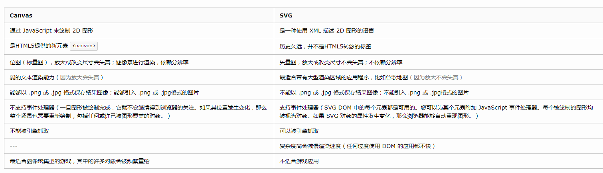

 ## BFC
块格式化上下文, 是web页面的可视化CSS渲染的一部分,是块盒子的布局过程发生的区域,也是浮动元素与其他元素交互的区域
* 以下方式会创建BFC
    * 根元素 `html` `body`
    * 浮动元素 float 不为 none
    * 绝对定位元素 position 为 absolute, fixed
    * 行内块元素 display 为 inlune-block
    * 表格单元格, 表格标题 display 为 table-cell, table-caption
    * 匿名表格单元格元素（元素的 display 为 table、table-row、 table-row-group、table-header-group、table-footer-group（分别是HTML table、row、tbody、thead、tfoot的默认属性）或 inline-table）
    * overflow 不为 visible
    * 无副作用BFC display 为 flow-root
    * contain 为 layout、content或 paint 的元素
    * 弹性元素（display 为 flex 或 inline-flex元素的直接子元素）
    * 网格元素（display 为 grid 或 inline-grid元素的直接子元素）
    * 多列容器（元素的 column-count 或 column-width 不为 auto，包括 column-count 为 1）
    * column-span 为 all 的元素始终会创建一个新的BFC，即使该元素没有包裹在一个多列容器中

## css阻塞

* css加载不会阻塞DOM树的解析
* css加载会阻塞DOM树的渲染
* css加载会阻塞后面js语句的执行
* 当页面只存在css，或者js都在css前面，那么DomContentLoaded不需要等到css加载完毕。
* 当页面里同时存在css和js，并且js在css后面的时候，DomContentLoaded必须等到css和js都加载完毕才触发。

## grid, flex 布局

* Grid 适合二维布局. Flex 适合一维布局

## white-space空白符处理

* normal
* nowrap: 永不换行, 合并多个空格
* pre: 保留空格, 不自动换行
* pre-wrap: 保留空格, 自动换行
* pre-line: 保留换行, 合并空格,

## word-break单词拆分

* normal
* keep-all: 换行不拆分单词, 空格可触发换行
* break-all: 拆分一切
* break-word: (chrome, safari 支持)

## word-wrap(overflow-wrap)
长度超过一行单词的拆分
* normal
* break-word: 只有溢出的单词被拆分

## 层叠上下文

* 根元素 `html` 称为根层叠上下文
* position 属性为非 static, 并设置 z-index为具体数值.
* 父元素 display 为 flex|inline-flex, 子元素z-index 不为 auto 子元素为层叠上下文元素
* 元素 opacity 属性值不为 1
* transform 不为 none
* mix-blend-mode 不为 normal
* filter 不为 none
* isolation 为 isolate

## box-sizing 
定义了user agent 如何计算一个元素的总宽度 总高度

* content-box 标准盒子模型, width,height 只包含内容的宽高, 不包括 border, padding, margin
* border-box width, height 包含border,padding, 不包含margin

## 居中

* 水平居中
	* 行内元素 text-align: center
	* 块级元素 
		* margin: 0 auto
		* 定位 + margin: 父级position:relative, 子级, position:absolute, 设置宽高, top:50%, left:50%, margin-left: 宽度一半, margin-top: 高度一半
		* 定位方法: 父级position:relative, 子级position:absolute, top:0,bottom:0,left:0, right:0  margin:auto
		* 单元格方法: 父级, display: table-cell, text-align: center, vertical-align: middle, 子元素: display: inline-table
		* 父级display:flex, justify-content: center
* 垂直居中
	* line-height = height  : 适用行内元素(单行文字)垂直居中
	* line-height + inline-block: 适用多对象的垂直居中 (外层设置inline-block, 内部包含多行)
		    父元素设置line-height, 子元素inline-block, 且设置line-height:1
	* :before + inline-block: 多对象垂直居中(基于基线)
		    利用:before伪类元素设定为100%高的inline-block, 将需要居中的子元素同样设置为inline-block, 使用vertical-align: middle垂直居中 **需处理inline-block间隙
	* absolute + margin负值
		    父元素设置,reliative 子元素absolute,top:50%, margin:  ( - )子元素高度一半
	* absosulte + margin auto 
            父元素固定高度, 子元素absolute, top:0, bottom: 0, margin: auto
	* absolute + translate
		    top, left 分别50%, translate(-50%, -50%)
	* flex + align-items
		    align-items: center
	* flex + margin auto
		    margin:auto
	* flex + align-self
		    align-self : center
	* grid + template
	* grid + align-items
		    align-items: center
	* grid + margin: auto
	* display : table-cell,  vertical-align: middle


## 盒子模型

* CSS 盒子模型具有内容 (content)、填充 (padding)、边框 (border)、边界 (margin)这些属性。我们所说的 width，height 指的是内容 (content) 的宽高。
* IE 盒模型width, height 包含border,padding

## link和@import区别

* link属于XHTML标签, 除了加载CSS外, 还能用于定义RSS, 定义rel连接属性等
* @import是CSS提供的, 只能加载CSS
* 页面被加载时, link会同时被加载, 而@import引用的css会等到页面加载完再加载

## 常见兼容性问题


* 浏览器默认的margin和padding不同, 加一个全局的 *{margin:0; padding:0}
* chrome中文界面默认将小于12px的文本强制按照12px显示, 可通过css属性 -webkit-text-size-adjust:none 设置
* 超链接访问过后 hover 样式就不出现了，被点击访问过的超链接样式不在具有 hover 和 active 了，解决方法是改变 CSS 属性的排列顺序: L-V-H-A : a:link {} a:visited {} a:hover {} a:active {}

## 清除浮动

* 一个块级元素如果没有设置height, 那么其高度就是由里面的子元素撑开, 如果元素使用浮动, 脱离了标准的文档流, 那么父元素的高度会将其忽略, 如果不清除浮动, 父元素会出现高度不够,那样如果设置border或者background都得不到正确的解析.

正是因为浮动的这种特性, 导致本属于普通流中的元素浮动之后, 包含框内部由于不存在其他普通流元素了, 也就表现出高度为0 , 所以需要闭合浮动元素, 使其包含框表现出正常的高度.
* 清除浮动的方法 
	* 父级div定义height
	* 结尾处加空div标签 clear:both
	* 父级定义 overflow: hidden, 不定义height
	* 父级div设置浮动
	* 父级display: table
	* 父级div定义伪类  :after {    clear:both;display:block;content: ""}  zoom:1


## position float display
**position**
* position 属性取值：static(默认)、relative、absolute、fixed、inherit、sticky。
* postision：static；始终处于文档流给予的位置。看起来好像没有用，但它可以快速取消定位，让 top，right，bottom，left 的值失效。在切换的时候可以尝试这个方法。
* 除了 static 值，在其他三个值的设置下，z-index 才会起作用。确切地说 z-index 只在定位元素上有效。
* position：relative 和 absolute 都可以用于定位，区别在于前者的 div 还属于正常的文档流，后者已经是脱离了正常文档流，不占据空间位置，不会将父类撑开。 定位原点 relative 是相对于它在正常流中的默认位置偏移，它原本占据的空间任然保留；absolute 相对于第一个 position 属性值不为 static 的父类。所以设置了 position：absolute，其父类的该属性值要注意，而且 overflow：hidden 也不能乱设置，因为不属于正常文档流，不会占据父类的高度，也就不会有滚动条。
* fixed 旧版本 IE 不支持，却是很有用，定位原点相对于浏览器窗口，而且不能变。 常用于 header，footer 或者一些固定的悬浮 div，随滚动条滚动又稳定又流畅，比 JS 好多了。fixed 可以有很多创造性的布局和作用，兼容性是问题。
* position：inherit。 规定从父类继承 position 属性的值，所以这个属性也是有继承性的，但需要注意的是 IE8 以及往前的版本都不支持 inherit 属性。
* sticky ：设置了sticky 的元素，在屏幕范围（viewport）时该元素的位置并不受到定位影响（设置是 top、left 等属性无效），当该元素的位置将要移出偏移范围时，定位又会变成 fixed，根据设置的 left、top 等属性成固定位置的效果。

**float**
* float：left (或 right)，向左（或右）浮动，直到它的边缘碰到包含框或另一个浮动框为止。 且脱离普通的文档流，会被正常文档流内的块框忽略。不占据空间，无法将父类元素撑开。
* 任何元素都可以浮动，浮动元素会生成一个块级框，不论它本身是何种元素。因此，没有必要为浮动元素设置 display：block。
* 如果浮动非替换元素，则要指定一个明确的 width，否则它们会尽可能的窄。 什么叫替换元素 ？根据元素本身的特点定义的， (X)HTML中的 img、input、textarea、select、object 都是替换元素，这些元素都没有实际的内容。 (X)HTML 的大多数元素是不可替换元素，他们将内容直接告诉浏览器，将其显示出来。

**display**
* display 属性取值：none、inline、inline-block、block、table 相关属性值、inherit。
* display 属性规定元素应该生成的框的类型。文档内任何元素都是框，块框或行内框。
* display：none 和 visiability：hidden 都可以隐藏 div，区别有点像 absolute 和 relative，前者不占据文档的空间，后者还是占据文档的位置。
* display：inline 和 block，又叫行内元素和块级元素。 表现出来的区别就是 block 独占一行，在浏览器中通常垂直布局，可以用 margin 来控制块级元素之间的间距（存在 margin 合并的问题，只有普通文档流中块框的垂直外边距才会发生外边距合并。行内框、浮动框或绝对定位之间的外边距不会合并。）； 而 inline 以水平方式布局，垂直方向的 margin 和 padding 都是无效的，大小跟内容一样，且无法设置宽高。 inline 就像塑料袋，内容怎么样，就长得怎么样；block 就像盒子，有固定的宽和高。
* inline-block 就介于两者之间。
* table 相关的属性值可以用来垂直居中，效果一般。
* flex

定位机制上面三个属性都属于 CSS 定位属性。CSS 三种基本的定位机制：普通流、浮动、绝对定位。
## css3 动画效果属性


* animation-name : 绑定到选择器的keyframe名称
* animation-duration : 完成动画所花费的时间
* animation-timing-function: 动画的速度曲线
* animation-delay: 动画开始之前的延迟
* animation-iteration-count: 动画播放次数
* animation-direction: 是否轮流反向播放动画 


## png、jpg、gif 图片格式

JPG 的特性
* 支持摄影图像或写实图像的高级压缩，并且可利用压缩比例控制图像文件大小。
* 有损压缩会使图像数据质量下降，并且在编辑和重新保存 JPG 格式图像时，这种下降损失会累积。
* JPG 不适用于所含颜色很少、具有大块颜色相近的区域或亮度差异十分明显的较简单的图片。

PNG 的特性
* 能在保证最不失真的情况下尽可能压缩图像文件的大小。
* PNG 用来存储灰度图像时，灰度图像的深度可多到 16 位，存储彩色图像时，彩色图像的深度可多到 48 位，并且还可存储多到 16 位的 α 通道数据。
* 对于需要高保真的较复杂的图像，PNG 虽然能无损压缩，但图片文件较大，不适合应用在 Web 页面上。
* 另外还有一个原则就是用于页面结构的基本视觉元素，如容器的背景、按钮、导航的背景等应该尽量用 PNG 格式进行存储，这样才能更好的保证设计品质。而其他一些内容元素，如广告 Banner、商品图片 等对质量要求不是特别苛刻的，则可以用 JPG 去进行存储从而降低文件大小。

GIF格式特点  
* 透明性: Gif 是一种布尔透明类型，既它可以是全透明，也可以是全不透明，但是它并没有半透明（alpha 透明）。 
* 动画：Gif 这种格式支持动画。 
* 无损耗性：Gif 是一种无损耗的图像格式，这也意味着你可以对 gif 图片做任何操作也不会使得图像质量产生损耗。 
* 水平扫描：Gif 是使用了一种叫作 LZW 的算法进行压缩的，当压缩 gif 的过程中，像素是由上到下水平压缩的，这也意味着同等条件下，横向的 gif 图片比竖向的 gif 图片更加小。 例如 50010 的图片比 10500 的图片更加小。 间隔渐进显示：Gif 支持可选择性的间隔渐进显示。 

由以上特点看出只有 256 种颜色的 gif 图片不适合作为照片，它适合做对颜色要求不高的图形。

## CSS Sprite


* 加速的关键，不是降低重量，而是减少个数。传统切图讲究精细，图片规格越小越好，重量越小越好，其实规格大小无计算机统一都按 byte 计算。客户端每显示一张图片都会向服务器发送请求。所以，图片越多请求次数越多，造成延迟的可越大。
* 利用 CSS Sprites 能很好地减少了网页的 http 请求，从而大大的提高了页面的性能，这也是CSS Sprites 的优点，也是其被广泛传播和应用的主要原因；
* CSS Sprites 能减少图片的字节，曾经比较过多次 3 张图片合并成 1 张图片的字节总是小于这 3 张图片的和。
* 解决了网页设计师在图片命名上的困扰，只需对一张集合的图片上命名就可以了，不需要对每一个小元素名，从而提高了网页的制作效率。
* 更换风格方便，只需要在一张或少张图片上修改图片的颜色或样式，整个网页的风格就可以改变。维护起方便。
* 诚然 CSS Sprites 是如此的强大，但是也存在一些不可忽视的缺点，如下：
* 在图片合并的时候，你要把多张图片有序的合理的合并成一张图片，还要留好足够的空间，防止板块内不不必要的背景；这些还好，最痛苦的是在宽屏，高分辨率的屏幕下的自适应页面，你的图片如果不够宽，很容背景断裂；
* CSS Sprites 在开发的时候比较麻烦，你要通过 photoshop 或其他工具测量计算每一个背景单元的精确位是针线活，没什么难度，但是很繁琐；
* CSS Sprites 在维护的时候比较麻烦，如果页面背景有少许改动，一般就要改这张合并的图片，无需改的好不要动，这样避免改动更多的 css，如果在原来的地方放不下，又只能（最好）往下加图片，这样图片的字加了，还要改动 css。
* CSS Sprites 非常值得学习和应用，特别是页面有一堆 ico（图标）。总之很多时候大家要权衡一下再决定是不是应用 CSS Sprites。


## CSS 选择符

CSS 选择符
* id选择器（ # myid）
* 类选择器（.myclassname）
* 标签选择器（div, h1, p）
* 相邻选择器（h1 + p）
* 子选择器（ul ` li）
* 后代选择器（li a）
* 通配符选择器（ * ）
* 属性选择器（a[rel = "external"]）
* 伪类选择器（a: hover, li: nth - child）

可继承的样式: font-size，font-family，color，ul，li，dl，dd，dt；  
不可继承的样式border padding margin width height 事实上，宽度也不是继承的，而是如果你不指定宽度，那么它就是 100%。由于你子 DIV 并没有指定宽度，那它就是 100%，也就是与父 DIV 同宽，但这与继承无关，高度自然也没有继承一说。  
优先级算法优先级就近原则，同权重情况下样式定义最近者为准; 载入样式以最后载入的定位为准;   
优先级为: !important ` id ` class ` tag , important 比 内联优先级高

## CSS3 新增伪类


* :root 选择文档的根元素，等同于 html 元素
* :empty 选择没有子元素的元素
* :target 选取当前活动的目标元素
* :not(selector) 选择除 selector 元素以外的元素
* :enabled 选择可用的表单元素
* :disabled 选择禁用的表单元素
* :checked 选择被选中的表单元素
* :after 选择器在被选元素的内容后面插入内容
* :before 选择器在被选元素的内容前面插入内容
* :nth-child(n) 匹配父元素下指定子元素，在所有子元素中排序第 n
* :nth-last-child(n) 匹配父元素下指定子元素，在所有子元素中排序第 n，从后向前数
* :nth-child(odd) 奇数
* :nth-child(even) 偶数
* :nth-child(3n+1)
* :first-child
* :last-child
* :only-child
* :nth-of-type(n) 匹配父元素下指定子元素，在同类子元素中排序第 n
* :nth-last-of-type(n) 匹配父元素下指定子元素，在同类子元素中排序第 n，从后向前数
* :nth-of-type(odd)
* :nth-of-type(even)
* :nth-of-type(3n+1)
* :first-of-type
* :last-of-type
* :only-of-type
* ::selection 选择被用户选取的元素部分
* :first-line 选择元素中的第一行
* :first-letter 选择元素中的第一个字符

## CSS3 新特性 

* CSS3 实现圆角（border-radius:8px）
* 阴影（box-shadow:10px）
* 对文字加特效（text-shadow）
* 线性渐变（gradient）
* 旋转、缩放、定位、倾斜
	* transform: rotate(9deg) scale(0.85,0.90) translate(0px,-30px) skew(-9deg,0deg);
* 增加了更多的 CSS 选择器
* 多背景 rgba


## absolute 计算方式跟正常流的不同

无论属于哪种，都要先找到其祖先元素中最近的 position 值不为 static 的元素，然后再判断：
* 若此元素为 inline 元素，则 containing block 为能够包含这个元素生成的第一个和最后一个 inline box 的 padding box (除 margin, border 外的区域) 的最小矩形；
* 否则，则由这个祖先元素的 padding box 构成。
* 如果都找不到，则为 initial containing block。

补充：
* static / relative：简单说就是它的父元素的内容框（即去掉 padding 的部分）
* absolute: 向上找最近的定位为 absolute / relative 的元素
* fixed: 它的 containing block 一律为根元素(html / body)，根元素也是 initialcontaining block  

## canvas与svg的区别

* Canvas 是基于像素的即时模式图形系统，最适合较小的表面或较大数量的对象，Canvas 不支持鼠标键盘等事件。
* SVG 是基于形状的保留模式图形系统，更加适合较大的表面或较小数量的对象。
* Canvas 和 SVG 在修改方式上还存在着不同。绘制 Canvas 对象后，不能使用脚本和 CSS 对它进行修改。因为 SVG 对象是文档对象模型的一部分，所以可以随时使用脚本和 CSS 修改它们。
* svg 绘制出来的每一个图形的元素都是独立的 DOM 节点，能够方便的绑定事件或用来修改，而 canvas 输出的是一整幅画布；
* svg 输出的图形是矢量图形，后期可以修改参数来自由放大缩小，不会是真和锯齿。而 canvas 输出标量画布，就像一张图片一样，放大会失真或者锯齿。

现在对两种技术做对比归纳如下：  

**Canvas**
* 依赖分辨率
* 不支持事件处理器
* 弱的文本渲染能力
* 能够以 .png 或 .jpg 格式保存结果图像
* 最适合图像密集型的游戏，其中的许多对象会被频繁重绘

**SVG**
* 不依赖分辨率
* 支持事件处理器
* 最适合带有大型渲染区域的应用程序（比如谷歌地图）
* 复杂度高会减慢渲染速度（任何过度使用 DOM 的应用都不快）
* 不适合游戏应用


## 文字在超出长度时省略号代替
超长长度的文字在省略显示后，如何在鼠标悬停时，以悬浮框的形式显示出全部信息
* 设置 width，
* overflow: hidden, 
* white-space: nowrap (规定段落中的文本不进行换行), 
* text-overflow: ellipsis，四个属性缺一不可。这种写法在所有的浏览器中都能正常显示。


## position跟display、overflow、float叠加效果

* display 属性规定元素应该生成的框的类型；
* position 属性规定元素的定位类型；
* float 属性是一种布局方式，定义元素在哪个方向浮动。
* 类似于优先级机制：position：absolute / fixed 优先级最高，有他们在时，float 不起作用，display 值需要调整。float 或者 absolute 定位的元素，只能是块元素或表格。


## 浏览器解析 CSS 选择器


* CSS 选择器的解析是从右向左解析的。
* 若从左向右的匹配，发现不符合规则，需要进行回溯，会损失很多性能。
* 若从右向左匹配，先找到所有的最右节点，对于每一个节点，向上寻找其父节点直到找到根元素或满足条件的匹配规则，则结束这个分支的遍历。
* 两种匹配规则的性能差别很大，是因为从右向左的匹配在第一步就筛选掉了大量的不符合条件的最右节点（叶子节点），而从左向右的匹配规则的性能都浪费在了失败的查找上面。
* 而在 CSS 解析完毕后，需要将解析的结果与 DOM Tree 的内容一起进行分析建立一棵 Render Tree，最终用来进行绘图。
* 在建立 Render Tree 时（WebKit 中的「Attachment」过程），浏览器就要为每个 DOM Tree 中的元素根据 CSS 的解析结果（Style Rules）来确定生成怎样的 Render Tree。


## 响应式设计, 及基本原理

* 响应式网站设计( Responsive Web design ) 是一个网站能够兼容多个终端，而不是为每一个终端做一个特定的版本。
* 基本原理是通过媒体查询检测不同的设备屏幕尺寸做处理。
* 页面头部必须有 meta 声明的 viewport。

```html
兼容低版本的 IE
<meta name="viewport" content="” width="device-width" initial-scale="1" maximum-scale="1" user-scalable="no"/>
```
## 视差滚动效果

视差滚动（Parallax Scrolling）通过在网页向下滚动的时候，控制背景的移动速度比前景的移动速度慢来创建出令人惊叹的 3D 效果。
* CSS3 实现。 优点：开发时间短、性能和开发效率比较好，缺点是不能兼容到低版本的浏览器
* jQuery 实现。 通过控制不同层滚动速度，计算每一层的时间，控制滚动效果。优点：能兼容到各个版本的，效果可控性好。缺点：开发起来对制作者要求高。
* 插件实现方式。 例如：parallax-scrolling，兼容性十分好。


## 动画最小时间间隔

多数显示器默认频率是 60Hz，即 1 秒刷新 60 次，所以理论上最小间隔为：1/60＊1000ms ＝ 16.7ms。

## css实现左侧固定宽度, 右侧宽度自适应

* 左侧 float 右侧 margin-left,  
* 左侧 float: left 右侧float:right, width: calc(100% - 固定宽度)
* 左侧 float; 右侧overflow: hidden
* 左侧 绝对定位 absolute 右侧margin-left
* 左右都 绝对定位 absolute 父级 relative  右侧 left
* 父级设置flex, 左侧设置固定宽度, 右侧flex:1


## 浮动的原理和工作方式

工作方式：浮动元素脱离文档流，不占据空间。浮动元素碰到包含它的边框或者浮动元素的边框停留。影响
* 浮动会导致父元素无法被撑开，影响与父元素同级的元素。
* 与该浮动元素同级的非浮动元素，如果是块级元素，会移动到该元素下方，而块级元素内部的行内元素会环绕浮动元素；而如果是内联元素则会环绕该浮动元素。
* 与该元素同级的浮动元素，对于同一方向的浮动元素(同级)，两个元素将会跟在碰到的浮动元素后；而对于不同方向的浮动元素，在宽度足够时，将分别浮动向不同方向，在宽度不同是将导致一方换行(换行与 HTML 书写顺序有关，后边的将会浮动到下一行)。
* 浮动元素将被视作为块元素。
* 而浮动元素对于其父元素之外的元素，如果是非浮动元素，则相当于忽视该浮动元素，如果是浮动元素，则相当于同级的浮动元素。
* 而常用的清除浮动的方法，则如使用空标签，overflow，伪元素等。


## rem、em、px、vh 与 vw 

一、 rem 的特点
* rem 的大小是根据 html 根目录下的字体大小进行计算的。
* 当我们改变根目录下的字体大小的时候，下面字体都改变。
* rem 不仅可以设置字体的大小，也可以设置元素宽、高等属性。
* rem 是 CSS3 新增的一个相对单位（root em，根em），这个单位与 em 区别在于使用 rem 为元素设定字体大小时，仍然是相对大小，但相对的只是 HTML 根元素。

这个单位可谓集相对大小和绝对大小的优点于一身，通过它既可以做到只修改根元素就成比例地调整所有字体大小，又可以避免字体大小逐层复合的连锁反应。 目前，除了 IE8 及更早版本外，所有浏览器均已支持 rem。 对于不支持它的浏览器，应对方法也很简单，就是多写一个绝对单位的声明。这些浏览器会忽略用 rem 设定的字体大小。  

二、px 特点
* px 像素（Pixel）。相对长度单位。像素 px 是相对于显示器屏幕分辨率而言的。  

三、em 特点 
* em 的值并不是固定的；
* em 会继承父级元素的字体大小。
* em 是相对长度单位。当前对行内文本的字体尺寸未被人为设置，相对于当前对象内文本的字体尺寸。如则相对于浏览器的默认字体尺寸。
* 任意浏览器的默认字体高都是 16px。

所有未经调整的浏览器一般都符合: 1em = 16px。那么 12px = 0.75em，10px = 0.625em。 为了简化 font-size 的换算，需要在 css 中的 body 选择器中声明 Fontsize = 62.5%，这就使 em 值变为 16px*62.5%=10px, 这样 12px = 1.2em, 10px = 1em, 也就是说只需要将你的原来的 px 数值除以 10，然后换上 em 作为单位就行了。  

四、vh 与 vw视口
* 在桌面端，指的是浏览器的可视区域；
* 在移动端，它涉及 3个 视口：Layout Viewport（布局视口），Visual Viewport（视觉视口），Ideal Viewport（理想视口）。
* 视口单位中的 “视口”，桌面端指的是浏览器的可视区域；移动端指的就是 Viewport 中的 Layout Viewport。

vh / vw 与 %
|单位|解释|
|----|----|
|vw|1vw = 视口宽度的 1%|
|vh|1vh = 视口高度的 1%|
|vmin|选取 vw 和 vh 中最小的那个|
|vmax|选取 vw 和 vh 中最大的那个|
比如：浏览器视口尺寸为 370px，那么 1vw = 370px * 1% = 6.5px (浏览器会四舍五入向下取 7)
vh / vw 与 % 区别
|单位|解释|
|----|----|
|%|元素的祖先元素|
|vh/vw|视口的尺寸|
不过由于 vw 和 vh 是 css3 才支持的长度单位，所以在不支持 css3 的浏览器中是无效的。

## 使用Css实现一个持续的动画.

```css 
animation: myAnimation 5s infinite;
@keyframes myAnimation {    
    from {top: 0}
    to {top: 100px}
}
```

## Canvas和svg区别


## setTimeout,与animation,requestAnimationFrame区别
* setTimeout基于浏览器的显示频率. 大概是16.7ms(1s渲染60次), 如果小于这个时间会丢帧, 
* requestAnimationFrame根据屏幕渲染频率进行渲染. 不会过度绘制, 不会掉帧, 在页面重绘的时候通知requestAnimationFrame, 
* css3不支持一些属性, 比如scrollTop,  
* css3动画效果有限,  只能是：Linear, Sine, Quad, Cubic, Expo等，但对于Back, Bounce等不支持


## 替换元素
替换元素在很多表现上都与普通内联元素不一样

* 根据"外在盒子"是内联还是块级, 我们把元素分为内联元素和块级元素,  而根据内容是否可替换, 我们把元素分为可替换元素和非替换元素
* 替换元素包括 img. video, canvas, input, textarea. iframe
* 替换元素外观不受css 的影响, 有自己的尺寸, 一般为 300*150, 在很多css属性上有自己的一套表现规则, 例如vertical-align默认就是元素下边缘对齐, 而不是基线
* 替换元素尺寸计算规则, css尺寸 ` html 尺寸` 固有尺寸
* 内联替换元素和块级替换元素规则一致, 即使设置display: block 其宽度也不会100%
* 替换元素固有尺寸无法改变, width和height改变的是content-box的宽高, 而默认替换元素的object-fill是fill, 也就是会填充content-box, 因此看上去像是改变了固有尺寸
* 替换元素before. after伪元素无效


## padding


* padding作用在块级元素上会影响盒子的宽高,  但是作用在内联元素上只作用在水平方向上有效果,垂直方向并不是没有影响, 只是不可视,  
* padding的百分比, padding不支持负值, padding百分比无论宽高都相对于width来说.
* padding区域是跟着行框盒子走的, 因此如果padding作用于内联元素, 则宽度和高度细节有差异, 并且padding会断行, 其原因在于 strut. 意思是说每一个行框盒子前面都有一个不可见的盒子, 其line-height和font-size都继承于父元素, 


## [vertical-align](http://echizen.github.io/tech/2018/04-05-read-css-world)

* 基线: 书写英语字母时, 字母'x'底部所在的位置, vertical-align的默认值是基线
	* x-height, 指'x'小写字母的高度, 术语是, 基线和等分线之间的距离, vertical-align: middle 指的是基线往上1/2 x-height的位置, 近似x交叉点位置, 1ex = x-height
	* line-height, 两行文字基线之间的距离
	* content area: 围绕文字看不见的box, 大小与font-size有关. 
* vertical-algn起作用的前提, : 元素为inline水平元素或table-cell元素, 默认情况div, p 设置vertical-align无效, float, absolute, 无效
* 属性值: 
	* 线类: baseline, top, middle, bottom
	* 文本类: text-top, 
	* 数值. 百分比, 百分比基于line-height计算

## css预处理器机制

css预处理器是为了简化css代码的编写,解决浏览器的兼容问题. 可以嵌套,使用变量,混入,继承,函数,逻辑控制等.