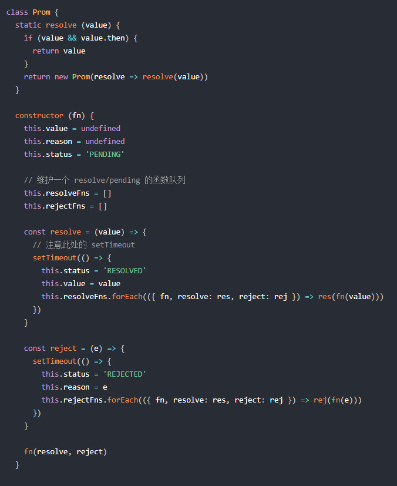
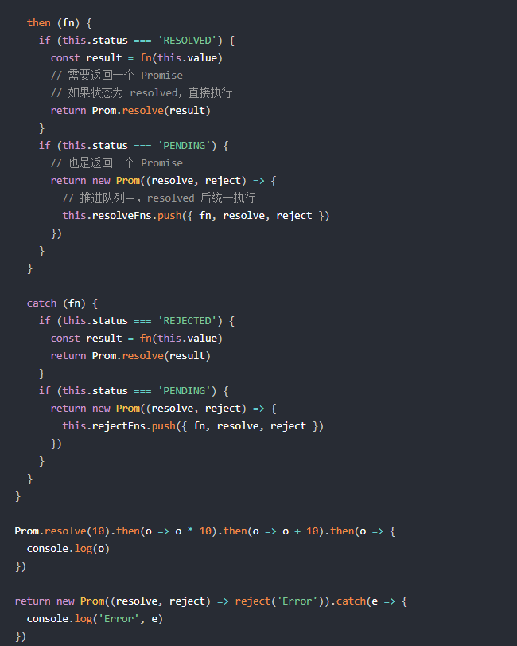
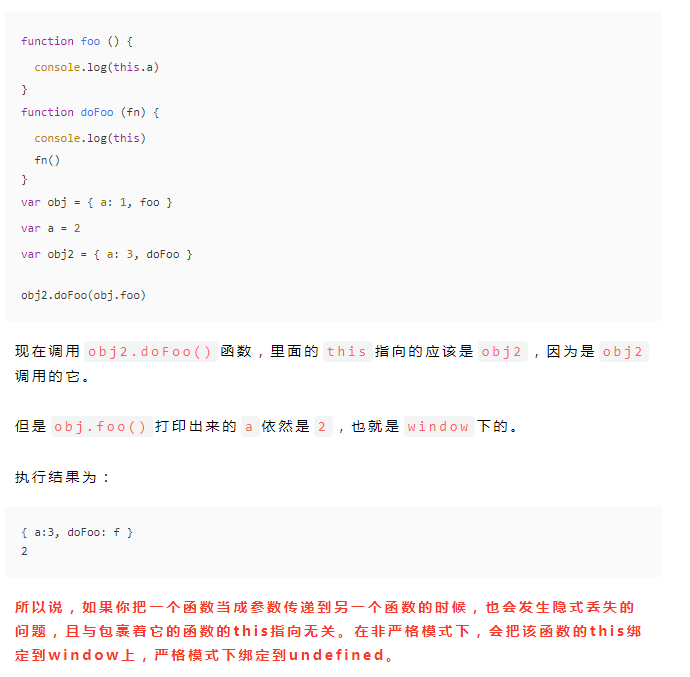
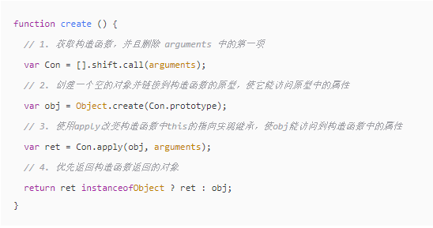

[参考1](https://juejin.im/post/5cab0c45f265da2513734390)  
[参考2](https://juejin.im/post/5d124a12f265da1b9163a28d)  
[实现参考](https://github.com/Geek-James/Blog/issues/27)  

## 函数式编程

* 函数式编程是一种‘编程范式’也就是如何编写程序的方法论， 属于结构化编程的一种， 主要思想就是把运算过程尽量写成一系列嵌套的函数调用。
* 函数式一等公民，函数与其他数据类型地位平等，可以赋值给其他变量，可以作为参数，或者作为返回值
* 只用表达式，不用语句, 也就是说每一步都是单纯的运算, 都有返回值, 目的是为了处理运算, 不考虑系统的读写I/O
* 没有副作用, 指的是函数内部与外部互动, 产生运算意外的其他结果, 意味着函数要保持独立, 所有功能就是返回一个新值, 没有其他行为, 
* 不修改状态
* 引用透明, 指的是函数的运行不依赖外部变量和状态, 只依赖输入的参数, 任何时候只要参数相同, 引用函数所得到的的值总是相同
	* 好处:
		* 代码简洁
		* 接近自然语言, 易于理解
		* 方便代码管理
		* 易于并发编程
		* 代码的热升级

## error 事件处理程序
* 当JavaScript运行时错误（包括语法错误）发生时，window会触发一个ErrorEvent接口的error事件，并执行window.onerror()。
* 当一项资源（如``或`<script>`）加载失败，加载资源的元素会触发一个Event接口的error事件，并执行该元素上的onerror()处理函数。这些error事件不会向上冒泡到window，不过（至少在Firefox中）能被单一的window.addEventListener捕获。


## 简易版 Function.prototype.bind
```js
Function.prototype.bind = function (context) {
    var self = this;
    return function () {
        return self.apply(context, arguments);
    };
};
var obj = {name: '前端架构师'};
var func = function () {
    console.log(this.name);
}.bind(obj);
func();
```
## call、apply、bind

* 怎么利用 call、apply 来求一个数组中最大或者最小值 ?
* 如何利用 call、apply 来做继承 ?
* apply、call、bind 的区别和主要应用场景 ?
    * call 跟 apply 的用法几乎一样，唯一的不同就是传递的参数不同，call 只能一个参数一个参数的传入。
    * apply 则只支持传入一个数组，哪怕是一个参数也要是数组形式。最终调用函数时候这个数组会拆成一个个参数分别传入。
    * 至于 bind 方法，他是直接改变这个函数的 this 指向并且返回一个新的函数，之后再次调用这个函数的时候 this 都是指向 bind 绑定的第一个参数。
    * bind 传参方式跟 call 方法一致。

适用场景：求一个数组中最大或者最小值
```js
// 如果一个数组我们已知里面全都是数字，想要知道最大的那个数，由于 Array 没有 max 方法，Math 对象上有
// 我们可以根据 apply 传递参数的特性将这个数组当成参数传入
// 最终 Math.max 函数调用的时候会将 apply 的数组里面的参数一个一个传入，恰好符合 Math.max 的参数传递方式
// 这样变相的实现了数组的 max 方法。min 方法也同理
const arr = [1,2,3,4,5,6]
const max = Math.max.apply(null, arr)
console.log(max) // 6
//参数都会排在之后
//如果你想将某个函数绑定新的`this`指向并且固定先传入几个变量可以在绑定的时候就传入，
//之后调用新函数传入的参数都会排在之后
const obj = {}
function test(...args) { console.log(args) }
const newFn = test.bind(obj, '静态参数1', '静态参数2')
newFn('动态参数3', '动态参数4')
//利用 call 和 apply 做继承
function Animal(name){
    this.name = name;
    this.showName = function(){
        console.log(this.name);
    }
}
function Cat(name){
    Animal.call(this, name);
}
// Animal.call(this) 的意思就是使用 this 对象代替 Animal 对象，
//那么 Cat 中不就有 Animal 的所有属性和方法了吗，Cat 对象就能够直接调用 Animal 的方法以及属性了
var cat = new Cat("TONY");
cat.showName(); 
//TONY将伪数组转化为数组（含有 length 属性的对象，dom 节点, 函数的参数 arguments）

// case1: dom节点：
<div class="div1">1</div>
<div class="div1">2</div>
<div class="div1">3</div>
let div = document.getElementsByTagName('div');
console.log(div);
// HTMLCollection(3) [div.div1, div.div1, div.div1] 里面包含length属性
let arr2 = Array.prototype.slice.call(div);console.log(arr2); 
// 数组 [div.div1, div.div1, div.div1]

//case2：fn 内的 argumentsfunction
fn10() {  
      return Array.prototype.slice.call(arguments);
}
console.log(fn10(1,2,3,4,5));
// [1, 2, 3, 4, 5]

// case3: 含有 length 属性的对象
let obj4 = {
    0: 1,
    1: 'thomas',
    2: 13,
    length: 3 // 一定要有length属性
}
console.log(Array.prototype.slice.call(obj4)); 
// [1, "thomas", 13]

//判断变量类型
let arr1 = [1,2,3];
let str1 = 'string';
let obj1 = { name: 'thomas' };
function isArray(obj) {   
    return Object.prototype.toString.call(obj) === '[object Array]';
}
console.log(isArray(arr1)); // true
// 判断类型的方式，这个最常用语判断 array 和 object ，null( 因为 typeof null 等于 object )
console.log(Object.prototype.toString.call(arr1)); // [object Array]
console.log(Object.prototype.toString.call(str1)); // [object String]
console.log(Object.prototype.toString.call(obj1)); // [object Object]
console.log(Object.prototype.toString.call(null)); // [object Null]
```
总结：
* 当我们使用一个函数需要改变 this 指向的时候才会用到 call apply bind
* 如果你要传递的参数不多，则可以使用 fn.call(thisObj, arg1, arg2 ...)
* 如果你要传递的参数很多，则可以用数组将参数整理好调用 fn.apply(thisObj, [arg1, arg2 ...])
* 如果你想生成一个新的函数长期绑定某个函数给某个对象使用，则可以使用 const newFn = fn.bind(thisObj); newFn(arg1, arg2...)

参考文章：
* [call、apply、bind 的区别](https://www.jianshu.com/p/bbeadae6127e)
* [聊一聊 call、apply、bind 的区别](https://segmentfault.com/a/1190000012772040)


## js 继承

父类:
```js       
function Person(name) {
    this.name = name;
    this.setname = function() {}
}
Person.prototype.age = 10    // 父类原型属性
```
* 原型链继承
```js
function Student(grade){ 
     this.grade=grade
}
Student.prototype = new Person()

* 子类的原型是父类的一个实例
* 这种方式实现的本质是通过将子类的原型指向了父类的实例，
* 所以子类的实例就可以通过__proto__访问到 Student.prototype 也就是Person的实例
* 这样就可以访问到父类的私有方法，然后再通过__proto__指向父类的prototype就可以获得到父类原型上的方法。
* 于是做到了将父类的私有、公有方法和属性都当做子类的公有属性       
缺点：
* 无法实现多继承
* 来自原型对象的所有属性被所有实例共享
* 创建子类实例时，无法向父类构造函数传参
* 要想为子类新增属性和方法，必须要在Student.prototype = new Person() 之后执行，不能放到构造器中
```
* 借用构造函数继承
```js
//这种方法的关键在于: 在子类构造函数中用call()调用父类构造函数
function Student(name, grade) {
    Person.call(this, name)
    this.grade = grade
}      
缺点：
	* 实例并不是父类的实例，只是子类的实例
	* 只能继承父类的实例属性和方法，不能继承原型属性和方法
	* 无法实现函数复用，每个子类都有父类实例函数的副本，影响性能
```
* 原型链 + 借用构造函数的组合继承
```js
//这种方式关键在于 : 通过调用父类构造，继承父类的属性并保留传参的优点，然后通过将父类实例作为子类原型，实现函数复用。       
function Student(name, grade) {
    Person.call(this,name)
    this.grade = grade
}
Student.prototype = new Person()
Student.prototype.constructor = Student   

优点：
    * 可以继承实例属性/方法，也可以继承原型属性/方法
    * 不存在引用属性共享问题
    * 可传参
    * 函数可复用
缺点：
	* 调用了两次父类构造函数，生成了两份实例
```
* 组合继承优化
```js
 //这种方式通过父类原型和子类原型指向同一对象，子类可以继承到父类的公有方法当做自己的公有方法，而且不会初始化两次实例方法/属性，避免的组合继承的缺点。
function Student(name, grade){
    Person.call(this, name)
    this.grade = grade
}
Student.prototype = Person.prototype       

缺点：
    * 没办法辨别是实例是子类还是父类创造的，子类和父类的构造函数指向是同一个。
```
* (原型式继承)
```js
借助原型可以基于已有的对象来创建对象，
var B = Object.create(A)
以A对象为原型，生成了B对象。B继承了A的所有属性和方法。
```
* 寄生式,
```
基于原型式继承,  并增强函数功能.  利用工厂函数包含原型式继承,
```
* 7. 寄生组合式
```js
//寄生式与组合式结合: 在子类构造函数中利用call()调用父类构造函数,  并封装一个继承原型的函数. 
//(创建父类原型副本, 将constructor指向子类构造函数, 并将这个原型赋值给子类原型)
function Student (name, grade) {
    Person.call(this, name)
    this.grade = grade
}
Student.prototype = Object.create(Person.prototype)
Student.prototype.constructor = Student
```
* 8. ES6中class继承
```
使用extends继承, 在constructor中用super(),  原理与寄生组合式继承类似
```

## trim 原型方法实现
```js
// 删除左右两端的空格   
function trim(str){
    return str.replace(/(^\s*)|(\s*$)/g, "");
}
// 删除左边的空格
/(^\s*)/g 
// 删除右边的空格 
/(\s*$)/g
```
## 内存泄漏常见操作

内存泄漏指任何对象在您不在拥有或有需要之后仍然存在,垃圾回收器定期扫描对象，并计算引用了每个对象的其他对象的数量。如果一个对象的引用数量为 0（没有其他对象引用过该对象），或对该对象的惟一引用是循环的，那么该对象的内存即可回收。
* setTomeout的第一个参数使用字符串而非函数, 会引发内存泄漏
* 闭包, 控制台日志, 循环 （在两个对象彼此引用且彼此保留时，就会产生一个循环）。


## 线程与进程的区别


* 一个程序至少有一个进程，一个进程至少有一个线程。
* 线程的划分尺度小于进程，使得多线程程序的并发性高。
* 另外，进程在执行过程中拥有独立的内存单元，而多个线程共享内存，从而极大地提高了程序的运行效率。
* 线程在执行过程中与进程还是有区别的。
* 每个独立的线程有一个程序运行的入口、顺序执行序列和程序的出口。但是线程不能够独立执行，必须依存在应用程序中，由应用程序提供多个线程执行控制。
* 从逻辑角度来看，多线程的意义在于一个应用程序中，有多个执行部分可以同时执行。 但操作系统并没有将多个线程看做多个独立的应用，来实现进程的调度和管理以及资源分配。这就是进程和线程的重要区别。


## eval()函数有什么用


* eval函数可计算某个字符串, 并执行其中的JavaScript代码


## 实现 add(1)(2)(3) = 6(柯里化)

柯里化就是把接收多个参数的函数变换成接收一个单一参数的函数    
```js
const curry = (fn, ...args) => args.length < fn.length ? (...arguments) => curry(fn, ...args, ...arguments) : fn(...args)
```
柯里化是指一个函数, 接收函数A作为参数, 运行后能够返回一个新的函数,并且这个新的函数能够处理函数A的剩余参数
```js
function createCuury(func, args) {
    var arity = func.length
    var args = args || 
    return function() {
        var _args = [].slice.call(arguments)
        [].push.apply(_args, args)
        if(_args.length < arity) {
            return createCurry.call(this, func,_args)
        }
        return func.apply(this, _args)
    }
}   
```

## script标签的defer和async

* defer
	* 如果 script 标签设置了该属性，则浏览器会异步的下载该文件并且不会影响到后续 DOM 的渲染；
	* 如果有多个设置了 defer 的 script 标签存在，则会按照顺序执行所有的 script；
	* defer 脚本会在文档渲染完毕后，DOMContentLoaded 事件调用前执行。
* async
	* async 的设置，会使得 script 脚本异步的加载并在允许的情况下执行 async 的执行，
	* 并不会按着 script 在页面中的顺序来执行，而是谁先加载完谁执行。

概括来讲，就是这两个属性都会使 script 标签异步加载，然而执行的时机是不一样的。也就是说 async 是乱序的，而 defer 是顺序执行，这也就决定了async 比较适用于百度分析或者谷歌分析这类不依赖其他脚本的库。

## 实现简单的promise

* 定义三个状态
	* const PENDING = 'pending'   
	* const FULFILLED = 'fulfilled'
	* const REJECTED = 'rejected'



## 执行上下文

* 执行上下文可以理解为当前代码的执行环境, 它会形成一个作用域, 为函数执行的环境，每一个函数执行时，都会给对应的函数创建这样一个执行环境。 JavaScript引擎会以栈(函数调用栈)的方式来处理一个程序中的多个执行上下文,栈底是全局上下文, 栈顶是当前执行上下文
	* 创建阶段:  执行上下文在创建阶段会分别创建变量对象,作用域链, 以及确定this指向
	* 代码执行阶段: 执行代码, 完成变量赋值, 函数引用,以及其他

## 变量对象

* 变量对象的创建过程
	* 建立arguments对象, 检查上下文的参数,建立该对象下的属性与属性值
	* 检查当前上下文的函数声明, 也就是使用function关键字声明的函数, 在变量对象中以函数名建立一个属性,属性值指向该函数所在的内存地址的引用
	* 检查当前上下文的变量声明, 没找到一个变量声明, 就在变量对象中以变量名建立一个属性, 属性值为undefined  (如果变量与函数同名, 这个阶段以函数值为准)
	* 未进入执行上下文的执行阶段之前,变量对象中的属性都不能访问, 但是进入执行阶段之后, 变量对象转变为活动对象, 里面的属性都可以访问, 然后开始进行执行阶段的工作(变量对象和活动对象其实是同一个对象, 只是处于执行上下文的不同声明周期, 不过只有处于函数调用栈顶的执行上下文的变量对象, 才能变成活动对象)


## 作用域与作用域链

* 作用域
	* 词法环境, 词法作用域, 其实就是作用域
	* JavaScript中 将作用域定义为一套规则, 这套规则用来管理js引擎如何在当前作用域以及嵌套的子作用域中根据标识符名称进行变量查找
	* JavaScript包括全局作用域, 函数作用域
* 作用域链
	* 作用域链 是由当前环境与上层环境的一系列变量对象组成, 他保证了当前执行环境对符合访问权限的变量和函数的有序访问


## 浏览器线程, 进程.

* 进程: CPU资源分配的最小单位, 拥有自己独立的内存空间地址, 拥有一个或多个线程
* 线程: CPU调度的最小单位, 是对进程粒度的进一步划分.

* 浏览器主线程常驻线程:
	* GUI渲染线程
		* 绘制页面. 解析HTML,CSS, 构建DOM树, 布局和绘制
		* 页面渲染和回流
		* 与js引擎线程互斥. 也就是所谓的js执行阻塞页面渲染
	* js引擎线程
		* 负责js脚本代码的执行
		* 负责执行准备好待执行的事件. 即定时器计数结束, 或异步请求成功并正确返回的事件
		* 与GUI渲染线程互斥, 执行时间过长将阻塞页面的渲染
	* 事件触发线程
		* 负责将准备好的事件, 交给js引擎线程执行
		* 多个事件加入任务队列的时候需要排队等待
	* 定时器触发线程
		* 负责执行异步的定时器类的事件: setTimeout, setInterval
		* 定时器到时间之后把注册的回调加到任务队列的队尾
	* http请求线程,
		* 负责执行异步请求
		* 主线程执行代码遇到异步请求的时候会把函数交给该线程处理, 当监听到状态变更时间, 如果有回调函数, 该线程会把回调函数加入到任务队列的队尾等待执行

## js运行机制

* js运行时大致会分为几个部分
	* call Stack: 调用栈(执行栈), 所有同步任务在主线程上执行, 形成一个执行栈, 因为js单线程的原因, 所以调用栈中每次只能执行一个任务. 当遇到的同步任务执行完之后, 由任务队列提供任务给调用栈执行
	* Task Queue: 任务队列, 存放异步任务. 当异步任务可以执行的时候, 任务队列会通知主线程, 然后该任务会进入主线程执行, 任务队列中的都是已经初步完成的异步操作, 而不是说注册一个异步任务就会被放在这个任务队列中
* 同步任务和异步任务
	* 同步任务: 必须等到结果来了之后才能做其他的事情,
	* 异步任务: 不需要等到结果来了才能继续往下走, 等结果期间可以做其他事情, 结果来了会收到通知


## 浏览器事件循环
单线程阻塞问题的一种解决机制

* 宏任务(macro-task, 新标准称为task): 浏览器每个页面对应一个进程, 拥有多个线程(js引擎线程, 渲染线程, 定时器线程....), 这些线程之间的通信时通过向对象的任务队列中添加一个任务(postTask)来实现的, 宏任务的本质可以认为是多线程时间循环或消息循环, 也就是线程间通信的一个消息队列, 宏任务的真面目是浏览器派发的,与js引擎无关, 参与了EventLoop调度.
	* script 整体代码
	* setTimeout, setInterval, setImmediate
	* I/O
	* UI render
* 微任务(micro-task, 新标准称为jobs): 微任务是在运行宏任务/同步任务的时候产生的, 属于当前任务, 不需要浏览器支持, 内置在js 中,直接被js的引擎执行掉
	* process.nextTick
	* Promise
	* Async/Await (实际是promise)
	* MutationObserver
执行宏任务, 然后执行该宏任务产生的微任务, 若微任务在执行过程中产生新的微任务, 则继续执行微任务, 微任务执行完毕, 再回到宏任务中进行下一轮循环setTimeout/Promise等我们称之为任务源。而进入任务队列的是他们指定的具体执行任务。    事件循环的顺序, 决定了JavaScript代码的执行顺序, 从script(整体代码)开始第一次循环. 之后全局上下文进入函数调用栈, 直到调用栈清空(只剩全局), 然后开始执行所有micro-task, 如果微任务执行过程中产生了新的微任务，则继续执行微任务，直到微任务的队列为空,当所有micro-task执行完毕, 循环再次从macro-task开始, 找到其中一个任务队列执行完毕, 然后再执行所有的micro-task, 这样一直循环下去. 其中每一个任务的执行, 无论是macro-task,还是micro-task, 都是借助函数调用栈来完成的.  
[参考](https://www.jianshu.com/p/12b9f73c5a4f)


## 闭包


* 闭包由两部分组成, 执行上下文(A), 以及在该执行上下文中创建的函数(B), 当B执行时. 如果访问了A中变量对象的值, 那么闭包就会产生, 正常函数的执行上下文,执行完毕,就会失去引用, 占用的内存空间会被垃圾回收器释放, 如果产生闭包就会被保留. 就可以访问到该执行上下文的变量
	* 大多数以函数B的名字代指这里的闭包.  chrome中,则以执行上下文A的函数名代指闭包
	* 闭包可以在其他的执行上下文中, 访问到函数的内部变量
	* 主要应用场景, 模块化, 柯里化
	* 每一个JS模块都可以认为是一个独立的作用域, 当代码执行时, 该词法作用域创建执行上下文, 如果在模块内部创建了可供外部引用访问的函数时, 就为闭包的产生提供了条件, 只要该函数在外部执行访问了内部的其他变量, 闭包就会产生

[参考](https://www.jianshu.com/p/21a16d44f150)

## this

* this的指向, 是在函数被调用的时候确定的, 也就是执行上下文创建的时候确定的, 且在函数执行过程中, this一旦确定, 就不可更改
* 在一个函数上下文中, this由调用者提供, 由调用函数的方式来决定, 如果调用者函数被某一个对象所拥有,那么该函数在调用时,内部的this指向该对象, 如果函数独立调用,那么该函数内部的this则指向undefined



## new 实现

* 创建一个空对象,并且this引用该对象, 同时继承该函数的原型
* 属性和方法被加入到this引用的对象中
* 新创建的对象由this引用, 最后隐式的返回this
```js
//将构造函数以参数形式传入
function New(func) {
    // 声明一个中间对象，该对象为最终返回的实例
    var res = {};if (func.prototype !== null) {
        // 将实例的原型指向构造函数的原型
        res.__proto__ = func.prototype;
    }
    // ret为构造函数执行的结果，这里通过apply，将构造函数内部的this指向修改为指向res，即为实例对象
    var ret = func.apply(res, Array.prototype.slice.call(arguments, 1));
    // 当我们在构造函数中明确指定了返回对象时，那么new的执行结果就是该返回对象
    if ((typeof ret === "object" || typeof ret === "function") && ret !== null) {return ret;}
    // 如果没有明确指定返回对象，则默认返回res，这个res就是实例对象return res;
}
```

## Generator

* Generator函数时一个状态机, 封装了多个内部状态, 执行Generator函数会返回一个遍历器对象, 返回的遍历器对象可以依次遍历Generator函数内部的每一个状态.
* Generator函数是一个普通的函数, 有两个特征,
	* function关键字与函数名之间有一个 *,
	* 函数体内部使用yield表达式, 定义不同的内部状态
* 调用Generator函数后, 该函数并不执行, 返回的遍历器对象是一个指向内部状态的指针对象, 必须使用next(), 使得指针移向下一个状态, ( 也就是说，每次调用next方法，内部指针就从函数头部或上一次停下来的地方开始执行，直到遇到下一个yield表达式（或return语句）为止。换言之，Generator 函数是分段执行的，yield表达式是暂停执行的标记，而next方法可以恢复执行。)
* yield只能在Generator函数里面使用,且没有返回值(也就是undefined)
* next函数带一个参数时, 该参数作为上一个yield表达式的返回值
* for...of 可以自动遍历Generator函数运行时生成的遍历器, 且此时不再需要调用next方法, next方法的返回对象的done为true时, for...of循环终止, 且不包含该返回对象(也就是不包含return返回值), 除了for...of循环以外，扩展运算符（...）、解构赋值和Array.from方法内部调用的，都是遍历器接口。这意味着，它们都可以将 Generator 函数返回的 Iterator 对象，作为参数。
* Generator的遍历器对象还有一个return方法, 可以返回给定的值, 并且终结遍历Generator函数
* yield* 可遍历具有Iterator接口的任何数据结构(例如, Generator, 数组等), 并返回遍历结果


## Axios

axios内有一个创建实例的工厂函数, 传入默认配置, 并且将原型复制到这个实例上, 上下文也指向这个实例, 在axios.create上有调用这个创建实例函数, 发送请求调用 Axios.prototype.request.
* 为什么axios既可以当函数用,也可以当对象用?
	* axios本质是函数, 赋值了一些别名方法. 比如get,post 最终调用的还是Axios.prototype.request
* 简述axios调用流程
	* 实际是调用Axios.prototype.request, 最终返回的是 promise链式调用, 实际请求是在dispatchRequest
* 拦截器原理
	* axios.interceptors.request(response).use()添加请求(响应)成功和失败的拦截函数, 在Axios.prototype.request 调用时, Interceptors.prototype.forEach遍历请求和响应拦截器,添加到真正发送请求dispatchRequest的两端, 从而做到请求钱拦截,响应后拦截,  拦截器支持用 Interceptors.prototype.eject 移除.
* axios的取消功能
	* 通过传递config配置cancelToken的形式来取消, 判断有传cancelToken, 在promise链式调用中dispatchRequest抛出错误, 在adapter中 request.abort() 取消请求, promise走向reject
* 浏览器可用, node也可用.
	* axios.defaults.adapter默认配置中.根据环境判断是浏览器还是node, 使用对应的适配器, 适配器支持自定义


## [手写new](https://mp.weixin.qq.com/s/IzUG8J_DO7BiKkExJESERA)

       
## 防抖和节流


* 防抖(debounce): 触发高频事件后n秒后函数只会执行一次, 如果n秒内事件再次触发, 则重新计算时间
* 节流(throttle): 高频事件触发, n秒内只会执行一次, 稀释函数的执行频率


## 弹窗组件实现原理
(modal. dialog, notification)


* 搭建组件的html,css: 遮罩层, 内容层
* 定制弹窗的内容: 通过slot插槽(react-props.children)接受从父组件传过来的内容
* 定制弹窗的样式: 通过props接受父组件传过来的宽高, 上下左右位置
* 组件开关: 通过父组件传进来的props和事件(vue- $emit)控制组件的显示与隐藏
* react可通过createPortal(content, node) 插入到body(传送门)


## session和cookie区别


* session保存在服务器, 客户端不知道其中信息
* cookie保存在客户端, 服务器能够知道其中信息
* session保存的是对象, cookis保存的是字符串
* session不能区分路径, 所有的session在任何一个地方都可以访问到
* cookie如果设置了路径参数, 同一个网站中不同路径下cookie互相访问不到


## 介绍cookie

* cookie是一些存储在用户电脑上的小文件
* 它是被设计用来保存一些站点的用户数据, 这样能够让服务器为这样的用户定制内容, 后者页面代码能获取到cookie然后发送到服务器
* cookie存储了所在地理位置, 以后每次进入地图默认定位在该点即可
* 属性: name. value, expires. max-age. domain. path. secure(https), httponly, sameSite
	* SameSite属性可以让cookie在跨站请求时不被发送. 从而阻止跨站请求伪造攻击(CSRF)
	* 有三种值, strict(不允许跨站), lax(部门第三方可以), none(所有都会发送cookie)
* 应用:
	* 会话状态管理（如用户登录状态、购物车、游戏分数或其它需要记录的信息）
	* 个性化设置（如用户自定义设置、主题等）
	* 浏览器行为跟踪（如跟踪分析用户行为等）


## cookies, sessionStorage, localStorage

* 共同:
	* 都是保存在浏览器端, 且同源
* 区别:
	* cookie数据始终在同源的http请求中携带, 即cookie在浏览器和服务器之间来回传递
	* sessionStorage和localstorage不会主动发送给服务器, 仅保存在本地
	* cookie数据还有路径的概念, 可以限制cookie只属于某个路径
	* cookie不能超过4k,
	* sessionStorage, localStorage, 可以达到5M
	* sessionStorage在关闭窗口前有效, localstorage始终有效, cookie在设置的时间内有效,
	* sessionStorage在不同窗口不共享. cookie, localstorage在所有同源的窗口都是共享的


## 性能优化

* 内容优化
	* 减少HTTP请求数.
		* 合并多个css,js文件, 利用css sprite整合图像, Inline Images(使用data: URL scheme), 合理设置http缓存
	* 减少DNS查找
	* 避免重定向
	* 使用ajax缓存
	* 延迟加载组件, 预加载组件,
	* 减少DOM元素数量. 页面中存在大量DOM元素, 会导致JavaScript遍历DOM 的小路变慢
	* 最小化iframe的数量, iframes提供了一个简单的方式把一个网站的内容嵌入到另一个网站, 但创建速度比其他方式创建速度慢1~2个数量级
	* 避免404, http请求时间消耗是很大的, 因此使用http请求来获得一个没有用处的响应是完全没有必要的.
* 服务器优化
	* 使用内容分发网络.(CDN) 把网站内容分散到多个,处于不同地域位置的服务器上可以加快下载速度
	* GZIP压缩
	* 设置ETag: ETags(实体标签)是web服务器和浏览器用于判断浏览器缓存中的内容和服务器原始内容是否匹配的一种机制
	* 提前刷新缓冲区
	* 对ajax请求使用GET方法
	* 避免空的图像src
* cookie优化
	* 减小cookie大小
	* 针对web组件使用域名无关的cookie
* css优化
	* 将css代码放在html页面的顶部
	* 避免使用css表达书
	* 使用link代替@import
	* 避免使用filters
* JavaScript
	* 将JavaScript脚本放在页面的底部
	* 将JavaScript和css作为外部文件来引用, 在实际应用中使用外部文件可以提高页面速度, 因为JavaScript和css文件都能在浏览器中产生缓存
	* 缩小JavaScript和css文件
	* 删除重复的脚本
	* 最小化DOM的访问, 使用JavaScript访问DOM 速度比较慢
	* 开发智能的事件处理程序
	* 谨慎使用with 避免使用eval函数, 减少作用域链查找
* 图像优化
	* 优化图片大小
	* 通过css sprite优化图片
	* 不要在HTML中使用缩放图片
	* favicon.ico要小而且可缓存


## js的两种回收机制

* 标记清除
	* 垃圾收集器在运行的时候会给存储在内存中的所有变量都加上标记(可以使用任何标记方式)
	* 然后, 它会去掉环境红的变量以及被环境中的变量引用的变量的标记
	* 在此之后再被加上的标记标量将被视为准备删除的变量,原因是环境中的变量已经无法访问到这些变量了.
	* 最后, 垃圾收集器完成内存清除工作, 销毁哪些带标记的值并回收他们所占用的内存空间
* 引用计数
	* 引用计数的含义是跟踪记录每个值被引用的次数, 当声明一个变量并将一个引用类型的值赋给该变量时, 这个时候的引用类型的值就会是引用次数+1, 如果同一个值又被赋给另外一个变量.则该值的引用次数又+1
	* 相反如果包含这个值的引用的变量又取得另外一个值, 即被重新赋了值. 那么这个值的引用就 -1, 当这个值的引用次数变成0时,表示没有用到这个值,这个值也无法访问, 这个值所占用的内存空间回收
	* 当垃圾收集器下次再运行时, 他就会释放引用次数为0的值所占用的内存


## ES5的继承与ES6的继承

* es5的继承实质上是先创建子类的实例对象, 然后再将父类的方法添加到this上,
* es6的继承机制完全不同, 实质上是先创建父类的实例对象this. (所以必须调用父类的super()) 然后再用子类的构造函数修改this


## 观察者模式与发布订阅模式

* 观察者模式: 定义了一种一对多的依赖关系, 让多个观察者对象同事监听某一个主体对象, 这个主体对象在状态变化时, 会通知所有的观察者对象, 他们能够自动更新自己
* 发布订阅模式, 消息的发送方叫做发布者(publishers), 消息不会直接发送给特定的接受者(订阅者(subscribe)), 就是发布者和订阅者不知道对方的存在, 需要一个第三方组件, 叫做信息中介, 将订阅者和发布者串联起来, 它过滤和分配所有信息的输入, 换句话说, 发布-订阅模式用来处理不同系统组件的信息交流. 即使这些组件不知道对方的存在


## 箭头函数

* 箭头函数不能被直接命名，不过允许它们赋值给一个变量
* 箭头函数不能用做构造函数，你不能对箭头函数使用new关键字
* 箭头函数也没有prototype属性箭头函数绑定了词法作用域，不会修改this的指向（**最大特点**）
* 箭头函数的作用域不能通过.call、.apply、.bind等语法来改变，这使得箭头函数的上下文将永久不变


## [Canvas](https://blog.coding.net/blog/what-is-canvas)
```js
// 画布渲染
var render = function () {
    // 清除画布
    context.clearRect(0, 0, canvas.width, canvas.height);
    // 绘制
    draw();
    // 继续渲染
    requestAnimationFrame(render);
};
render();

* 原理: 不断清除画布, 不断绘制.
```

## common.js与es6中模块

* CommonJS是一种模块规范. 最初用于Nodejs,  目前浏览器对es module兼容不好. 平时的webpack使用中 babel会转为Commonjs
* commonjs 模块输出的是一个值的拷贝. ES6模块输出的是值的引用
* commonjs 是运行时加载, es6是编译时输出接口
* commonjs是单个值导出, es6 可以导出多个
* common是动态语法可以写在判断里, es6只能写在顶层
* common的this是当前模块, es6 this是undefined
