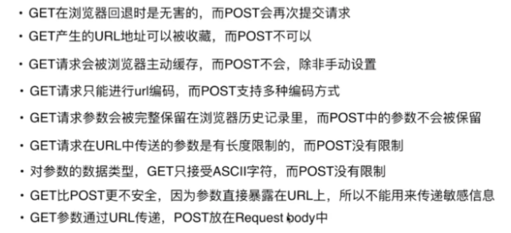
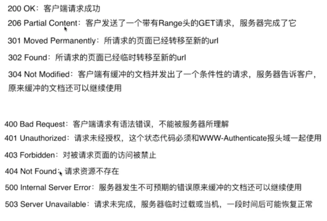

## 常见的浏览器内核

* Trident 内核：IE, 360，搜狗浏览器 MaxThon、TT、The World,等。[又称 MSHTML]
* Gecko 内核：火狐，FF，MozillaSuite / SeaMonkey 等
* Blink内核：Opera7 及以上。[Opera 内核原为：Presto，现为：Blink]
* Webkit 内核：Safari，Chrome 等。 [ Chrome 的：Blink（WebKit 的分支）]

## 对浏览器内核的理解

* 内核主要分成两部分：渲染引擎(layout engineer 或 Rendering Engine) 和 JS 引擎。
* 渲染引擎
* 负责取得网页的内容（HTML、XML、图像等等）、整理讯息（例如加入 CSS 等），以及计算网页的显示方式，然后会输出至显示器或打印机。 浏览器的内核的不同对于网页的语法解释会有不同，所以渲染的效果也不相同。 所有网页浏览器、电子邮件客户端以及其它需要编辑、显示网络内容的应用程序都需要内核。
* JS 引擎
* 解析和执行 javascript 来实现网页的动态效果。
* 最开始渲染引擎和 JS 引擎并没有区分的很明确，后来 JS 引擎越来越独立，内核就倾向于只指渲染引擎。

## v8引擎
chrome的V8，firefox的SpiderMonkey，Safari的Nitro

常用的4个模块:
* parser: 将JavaScript代码转换为抽象语法树(ast),  js源码 --`词法分析--` tokens --`语法分析 --` AST, token过程具体由一个名为scanner的 
* lgnition: lgnition是V8提供的一个解释器, 他的作用是负责将抽象语法树转换为字节码, 同时收集下一个极端(编译)所需要的信息, 这个过程, 我们可以理解为预编译过程.
* TurboFan: V8引擎的编译器模块, 利用lgnition收集到的信息, 将字节码转换为汇编代码
* orinoco: 垃圾回收模块, orinoco也是使用标记清除法来进行垃圾回收

## [post和get区别](https://mp.weixin.qq.com/s?__biz=MzI3NzIzMzg3Mw==&mid=100000054&idx=1&sn=71f6c214f3833d9ca20b9f7dcd9d33e4#rd)
  

状态码  
  

           
## 敲入URL到渲染完成的整个过程
  * 输入地址, 浏览器会构建请求行 `GET / HTTP/1.1`, 查找强缓存
  * 浏览器引入了DNS预取技术, 利用现有的DNS机制, 提前解析网页中可能的网络连接,
  * 当我们开始输入网址的时候, 浏览器其实已经在智能的匹配可能的url了, 会从历史记录,书签等地方. 找到已经输入的字符串可能对应的url,给出智能提示, 可以补全url地址, 还没有按下enter时, 浏览器已经开始使用DNS预取技术解析域名了.
  * 根据DNS查找对应的IP地址
	* 浏览器搜索自己的DNS缓存
	* 没有缓存时, 在操作系统的缓存中查找, 这一步会查找本机的hosts, 查找对应的域名映射
	* 系统缓存也没有, 就到路由器查找, 一般路由器也会有dns缓存
	* 如没有, 操作系统将域名发送至本地域名服务器--递归查询方式, 本地域名服务器查询自己的dns缓存, 查找成功则返回结果, 否则采用迭代查询方式,  本地域名服务器为网络接入服务器商, 比如中国电信, 中国移动
	* 本地域名服务器将得到的IP地址返回给操作系统, 同时将IP地址缓存起来
	* 操作系统将IP地址返回给浏览器, 同时也将IP地址缓存起来, 
	* 至此, 浏览器已经得到域名对应的IP地址
  * 建立TCP连接
	* TCP是一种面向有连接的传输层协议, 他可以保证两端通信主机之间的通信可达, 他能够处理在传输过程中丢包, 传输顺序乱掉等异常情况, 此外他还能有效利用带宽,缓解网络拥堵.
	* 通过三次握手建立tcp连接
	* 在tcp连接建立完成之后,就可以发送Http请求了
	* 断开连接, 四次挥手.
  * 服务器收到请求并相应
	* 在接收和解释请求消息后服务器返回一个http响应消息
	* http响应由三个部分组成, 分别是 状态行, 消息报头, 响应正文
  * 浏览器接收服务器响应结果并处理
	* 解析HTML, 构建DOM树,
	* 解析CSS, 生成CSS规则树,
	* 合并DOM树和CSS树, 生成render树
	* 布局render树, 负责各元素尺寸,位置的计算
	* 绘制render树, 绘制页面像素信息
	* 浏览器会将各层的信息发送GPU, GPU会将各层合成(composite),显示在屏幕
		* 构造DOM树
			* 在webkit中 HTML解释器将字节流解码成字符流, 然后通过词法分析器解释成词语(token), 之后经过语法分析器构建成节点, 最后这些节点被组建成一颗DOM树
			* 浏览器在解析html文件过程中, 会自上而下加载, 并在加载过程中进行解析渲染,在解析过程中, 如果遇到请求外部资源,请求过程是异步的,不影响html文档加载
			* html的解释, 布局, 渲染等工作基本上就是工作在渲染线程上, 因为DOM树只能在渲染线程上创建和访问
			* 解析过程中, 浏览器首先会解析HTML文件构建DOM树, 然后解析css文件构建render树, 等到render树构建完成后,浏览器开始布局render树并将其绘制在屏幕上
		* 解释css
			* css解释过程是指从css字符串经过css解释器处理后变成渲染引擎内部规则的表示过程
			* 生成样式规则后, 会进行样式规则匹配,规则的匹配则是由ElementRuleCollector类来计算并获得, 并从DocumentRuleSets类中获取规则集合, 依次按照ID,class,标签等匹配获得元素的样式.
			* 从整个网页的加载和渲染过程来看, Css解释和规则匹配处于DOM树建立之后, RenderObject树建立之前, CSS解释器解释后的结果会保存起来,然后RenderObject树基于该结果来进行规范匹配和布局计算.
		* 渲染过程遇到js
			* 当文档加载过程遇到js文件, html文档会挂起渲染(加载解析渲染)的线程, 不仅要等待文档中js文件加载完毕, 还要等待解析执行完毕,才可以恢复html文档的渲染线程,因为js有可能会修改dom, 最为经典的document.write
			* DOM树构建完之后, webkit触发DOMContentLoaded事件, 当所有资源被加载完之后, webkit触发onload事件
			* webkit将dom树构建过程中需要执行的js代码交由HTMLScriptRunner类来负责
			* js的执行机制可以看做是一个主线程加上一个任务队列, 同步任务就是放在主线程上执行的任务, 异步任务就是放在任务队列中的任务, 所有同步任务在主线程上执行,形成一个执行栈, 异步任务有了运行结果就会在任务队列中放置一个事件, 脚本运行时先一次运行执行栈, 然后会从任务队列里提取事件,运行任务队列中的任务,不断重复.
		* 渲染合成render树
			* Html经过解释后, 生成DOM树, 在DOM树构建完成之后, webkit会为dom树节点构建RenderObject树, 再通过RenderObject树构建出RenderLayer树
			* renderObject树是基于DOM树建立起来的一颗新树, RenderObject树节点和DOM节点不是一一对应关系, 因为有可视节点与不可视节点.
			* renderLayer节点和RenderObject节点不是一一对应关系, 而是一对多的关系
		* 布局
			* 当webkit创建RenderObject对象之后, 根据框模型来计算他们的位置.大小等信息
			* 布局计算是一个递归的过程, 因为一个节点的大小通常需要先计算他的子女节点的位置, 大小等信息,
		* 绘图
			* 绘图操作就是绘图上下文, 所有绘图的操作都是在该上下文中来进行的
			* 绘图上下文分为两种类型,一是2D图形上下文, 二是3D绘图上下文.
			* 网页的渲染方式有三种方式, 1. 软件渲染, 2. 硬件加速渲染,3 混合模式
			*  绘图操作使用CPU,称为软件渲染, 使用GPU, 称为硬件加速渲染, 
			* 理想情况下,每个层都有绘制的存储区域, 用来保存绘图结果, 最后需要将这些层的内容合并到同一个图像之中. 称之为合成(Compositing), 
			* 所以在完成构建DOM树之后, Webkit会调用绘图操作,软件渲染或硬件加速渲染, 将模型绘制出来.呈现在屏幕上.

## 深入理解https
https: 是在http上建立ssl加密层, 并对传输数据进行加密, 是http协议的安全版, 
* 作用:
	* 对数据进行加密, 并建立一个信息安全通道, 来保证传输过程中的数据安全
	* 对网站服务器进行真实身份认证
* http协议存在的问题
	* 通信使用明文, 内容可能被窃听.
	* 无法证明报文的完整性, 所以可能遭篡改
	* 不验证通信方的身份, 有可能遭遇伪装
* https优势
	* 数据隐私性: 内容经过对称加密, 每个链接生成一个唯一的加密秘
	* 数据完整性: 内容传输经过完整性校
	* 身份认证: 第三方无法伪装服务端(客户端)身份
* 如何解决上诉问题
	* https并非是应用层的一种新协议, 只是http通信接口部分用ssl和tls协议代替而已
	* 通常http直接和tcp通信, 当使用ssl时, 则演变成先和ssl通信, 在由ssl和tcp通信.
	* https协议的主要功能基本都依赖于TLS/SSL协议, TLS/SSL的功能实现主要依赖于三类基本算法: 散列函数,对称加密和非对称加密, 其利用非对称加密实现身份认证和秘钥协商, 对称加密算法采用协商的秘钥对数据加密, 基于散列函数验证信息的完整性.
	* 加密. 数字签名. 数字证书
* 对称加密: 加密和解密用的是同样的秘钥
* 非对称加密: 有A,B两把秘钥, A加密过的数据包只能用B解密, B加密的数据包只能用A解密
* 加解密过程: 
	* 首先,浏览器会给服务器发送一个随机数`client_random`和一个`加密的方法列表`
	* 服务器接收后给浏览器返回另一个随机数`server_random`和`加密方法`和`数字证书(公钥)`
	* 服务器和客户端拥有三样相同的凭证: client_random,server_random和加密方法, 还有一个公钥加密的`pre_random`
	* 用加密方法将几个随机数混合起来生成秘钥
	* 添加数字证书: 服务器向浏览器证明自己的身份, 把公钥传给服务器

## 浏览器缓存实现原理
* 浏览器缓存将文件保存在客户端, 好的缓存策略可以减少对网络带宽的占用, 可以提高访问速度, 提高用户体验, 还可以减轻服务器的负担
* 当一个客户端请求web服务器, 请求的内容可以从以下几个地方获取, 服务器, 浏览器缓存, 或缓存服务器中, 页面文件有三种缓存状态, 
	* 最新的. : 选择不缓存页面. 每次请求时都从服务器获取最新的内容
	* 未过期的: 在给定的时间内缓存, 如果用户刷新或页面过期则去服务器请求, 否则读取本地的缓存, 这样可以提高浏览器速度
	* 过期的, 重新获取
* 页面缓存的状态由http header决定. 一个浏览器请求信息, 一个是服务器响应信息, 主要包括:
	* Pragma: no-cache, Cache-control, expires, Last-Modified, if-modified-since
	* cache-control的主要参数
		* cache-control: private/public, public响应会被缓存, 并且在多用户间共享, private响应只能够作为私有的缓存, 不能在用户间共享
		* cache-control:no-cache, 不进行缓存, 
		* cache-control: max-age=x 缓存时间, 以秒为单位
		* cache-control must-revalidate, 如果页面过期, 则去服务器获取
	* expires 显示的设置页面过期时间
	* last-modified: 请求对象最后一次的修改时间, 用来判断缓存是否过期, 通常有文件的时间信息产生
	* if-modified-since: 客户端发送请求附带的信息, 指浏览器缓存请求对象的最后修改日期, 用来和服务器端的last-modified做比较  

缓存分为强缓存和协商缓存
* 强缓存: 当浏览器准备发送Http请求时, 它检查之前曾经发送过这条请求, 而且响应结果带了Expires这个响应头并设置了一个绝对时间, 如果未超过这个时间, 浏览器就不会发送请求了. 而是直接取之前的返回结果, expires是http1.0时代的强缓存依据, http1.1补充了 Cache-Control这个响应头作为强缓存依据, Cache-Control的通常用法是cache-control:max-age=31600, 他表示资源有效时间, 是一个相对时间, cache-control的存在解决了当服务器时间和客户端时间不一致引发的问题. 我们发出的http资源的强缓存依然有效.  
* 协商缓存: 
	* Last-Modified, If-Modified-Since :一个请求响应时会返回一个响应头, Last-Modified表示这个资源上次修改的时间, 下次相同的资源请求会带上If-Modified-Since, 值和上次的last-modified相同, 服务端通过判断if-Modified-Since这个时间是否是当前资源的最后修改时间, 来决定是否使用缓存, 如果可以使用缓存就会以304状态码返回, 强依赖系统时间
	* Etag, if-None-Match: 和上面的过程非常类似, 服务端第一次返回资源时会生成一个资源的摘要, 作为相应头Etag返回给客户端. 客户端请求时,通过if-none-match带上之前Etag的值,服务端来比较if-none-match和当前资源的摘要是否一致来判断是否命中缓存

::: tip 总结 
* 首先通过`Cache-control`验证强缓存是否可用, 如果强缓存可用, 直接使用, 否则进入协商缓存, 即发送http请求
* 服务器通过请求头中的`If-Modified-Since`或者`If-None-Match`字段检查资源是否更新, 若资源更新, 返回资源和200状态码, 否则,返回304 告诉浏览器直接从缓存获取资源
:::

## http协议头字段
* http协议头字段. 
	* http的头域包括, 通用头, 请求头, 响应头, 实体头
	* 每个头域由一个域名, 冒号, 和域值三部分组成
	* 域名大小无关, 域值前可以添加任何数量的空格符, 头域可以被扩展为多行, 在每行开始处, 使用至少一个空格或制表符.

## JWT(JSON Web Token)
* 跨域认证问题
	* 互联网用户认证流程
	    * 用户向服务器发送用户名和密码
	    * 服务器验证通过后, 在当前对话(session)里面保存相关数据, 比如用户角色, 登录时间等
	    * 服务器向用户返回一个session_id, 写入用户Cookie
	    * 用户随后的每一次请求, 都会通过cookie, 将session_id传回服务器
	    * 服务器收到session_id, 找到前期保存的数据, 由此得知用户的身份
    * 这种问题的模式的问题在于, 扩展性不好, 如果是服务器集群, 就要求session数据共享
* JWT
	* 原理: 服务器认证后, 生成一个JSON对象,发回给用户, 用户与服务器通信时, 都要发回这个JSON对象, 服务器完全只靠这个对象认定身份, 为了防止用户篡改数据, 服务器在生成这个对象的时候, 会加上签名, 
	* 数据结构: 他是一个很长的字符串, 中间用点分隔成三个部分. 
		* Header(头部): JSON对象用来描述JWT的元数据, { alg:'HS256', typ:'JWT' } 使用Base64URl算法转成字符串
		* Payload(负载): JSON对象用来存放实际需要传递的数据, JWT规定了7个官方字段, 除了官方字段,还可以定义私有字段, 也要使用Base64URL算法转为字符串
			* iss (issuer)：签发人
			* exp (expiration time)：过期时间
			* sub (subject)：主题
			* aud (audience)：受众
			* nbf (Not Before)：生效时间
			* iat (Issued At)：签发时间
			* jti (JWT ID)：编号
		* Signature(签名): 对前两部分的签名, 防止数据篡改, 首先需要制定一个秘钥, 这个密钥只有服务器才知道, 不能透露给用户, 然后, 使用Header里面指定的签名算法, 算出签名以后, 把Header, payload, Signature三个部分平成一个字符串, 每个部分之间用点分隔
	* 使用方式.:客户端收到服务器返回的JWT, 可以存储在cookie里面, 也可以存储在localStorage, 此后,客户端每次与服务器通信, 都要带上这个JWT,可以放在Cookie里面自动发送, 但是这样不能跨域, 更好的方法是放在http请求头信息, Authorization字段里面
	* 特点: 
		* 默认不加密, 
		* 不仅可以用于认证, 也可以用于交换信息, 有效使用JWT, 可以降低服务器查询数据库的次数
		* JWT最大的缺点是, 由于服务器不保存session状态, 因此无法在使用过程中废止某个token, 或者更改token的权限, 也就是说 一旦JWT签发了在到期之前始终有效,除非服务器部署额外的逻辑, 
		* JWT本身包含了认证信息, 一旦泄露, 任何人都可以获得该令牌的所有权限, 为了减少盗用, JWT的有效期应该设置的比较短, 
		* 为了减少盗用, JWT不应该使用http, 要使用https传输
	* 优点: 
		* 跨语言通用
		* 可以存储业务逻辑所必要的飞敏感信息
		* 便于传输, 构成简单, 字节占用小, 
		* 不需要在服务端保存会话, 易于扩展

## Xss与CSP, CSRF
XSS  
* XSS攻击是指浏览器中执行恶意脚本, 从而拿到用户的信息并进行操作, 一般用来窃取cookie, 监听用户行为, 修改dom伪造登录表单, 在页面生成悬浮广告
* XSS实现的三种方式:
	* 存储型: 将脚本存储到了服务端的数据库, 然后在客户端执行这些脚本, 达到攻击的目的
	* 反射型: 通过作为网络请求的参数, 经过服务器, 然后在反射到HTML文档. 执行解析.  服务器不会存储这些脚本
	* 文档型: 在数据传输过程中, 劫持到网络数据包, 修改里面的html文档.  劫持方式包括 WIFI路由器劫持, 本地恶意软件等.
* 解决办法: CSP. cookie的HttpOnly

CSP  
* 内容安全策略   (CSP) 是一个额外的安全层，用于检测并削弱某些特定类型的攻击，包括跨站脚本 (XSS) 和数据注入攻击等。无论是数据盗取、网站内容污染还是散发恶意软件，这些攻击都是主要的手段。
* CSP 被设计成完全向后兼容（除CSP2 在向后兼容有明确提及的不一致;  更多细节查看这里 章节1.1）。不支持CSP的浏览器也能与实现了CSP的服务器正常合作，反之亦然：不支持 CSP 的浏览器只会忽略它，如常运行，默认为网页内容使用标准的同源策略。如果网站不提供 CSP 头部，浏览器也使用标准的同源策略。
* 为使CSP可用, 你需要配置你的网络服务器返回  Content-Security-Policy  HTTP头部 ( 有时你会看到一些关于X-Content-Security-Policy头部的提法, 那是旧版本，你无须再如此指定它)。
* 除此之外,  `meta`  元素也可以被用来配置该策略
* CSP 的主要目标是减少和报告 XSS 攻击 ，XSS 攻击利用了浏览器对于从服务器所获取的内容的信任。恶意脚本在受害者的浏览器中得以运行，因为浏览器信任其内容来源，即使有的时候这些脚本并非来自于它本该来的地方。
* CSP通过指定有效域——即浏览器认可的可执行脚本的有效来源——使服务器管理者有能力减少或消除XSS攻击所依赖的载体。一个CSP兼容的浏览器将会仅执行从白名单域获取到的脚本文件，忽略所有的其他脚本 (包括内联脚本和HTML的事件处理属性)。
* 作为一种终极防护形式，始终不允许执行脚本的站点可以选择全面禁止脚本执行。
* 除限制可以加载内容的域，服务器还可指明哪种协议允许使用；比如 (从理想化的安全角度来说)，服务器可指定所有内容必须通过HTTPS加载。一个完整的数据安全传输策略不仅强制使用HTTPS进行数据传输，也为所有的cookie标记安全标识 cookies with the secure flag，并且提供自动的重定向使得HTTP页面导向HTTPS版本。网站也可以使用  Strict-Transport-Security  HTTP头部确保连接它的浏览器只使用加密通道。
* 配置内容安全策略涉及到添加 Content-Security-Policy  HTTP头部到一个页面，并配置相应的值，以控制用户代理（浏览器等）可以为该页面获取哪些资源。比如一个可以上传文件和显示图片页面，应该允许图片来自任何地方，但限制表单的action属性只可以赋值为指定的端点。一个经过恰当设计的内容安全策略应该可以有效的保护页面免受跨站脚本攻击。
* 一个策略由一系列策略指令所组成，每个策略指令都描述了一个针对某个特定类型资源以及生效范围的策略。你的策略应当包含一个default-src策略指令，在其他资源类型没有符合自己的策略时应用该策略(有关完整列表查看default-src )。一个策略可以包含 default-src  或者 script-src 指令来防止内联脚本运行, 并杜绝eval()的使用。 一个策略也可包含一个 default-src 或  style-src 指令去限制来自一个 `style` 元素或者style属性的內联样式。
  
CSRF:跨站请求伪造  
> 指的是黑客诱导用户点击链接, 打开黑客的网站, 然后利用用户目前的登录状态发起跨站攻击,利用受害者在被攻击网站已经获取的注册凭证, 绕过后台的用户验证, 达到冒充影虎对呗攻击的网站执行某项操作的目的, 主要利用浏览器自动发送cookie
  
流程: 
* 受害者登录 a.com, 保留了登录凭证
* 攻击者引诱受害者访问了b.com
* b.com向a.com发送了一个请求, 
* a.com 接收到请求后, 对请求进行验证, 并确认是受害者的凭证
* a.com以受害者的名义执行了一些操作
* 攻击完成, 攻击者在受害者不知情的情况下, 冒充受害者, 让a.com执行了自定义的操作  
  
攻击类型
* GET类型的CSRF ``
* POST类型的CSRF, 一般是一个自动提交的表单
* 链接类型, 需要用户点击链接才会触发
  
防护措施
* 同源检测: 禁止外域对我们发起请求,基于`Origin Header` `Referer Header`
* CSRF Token
* 分布式校验
* 双重Cookie校验
* Samesite Cookie属性

## http字段

* 通用首部字段（General Header Fields） 请求和响应报文两方都会使用的首部字段。
	* cache-control 控制缓存
	* connection 连接管理, 逐条首部
	* upgrade 升级为其他协议
	* via 代理服务器的相关信息
	* wraning 错误和警告通知
	* transfor-encoding 报文主题的传输编码格式
	* trailer 报文末端的首部一览
	* pragma 报文指令
	* date 创建报文的日期
* 请求首部字段（Reauest Header Fields）客户端向服务器发送请求的报文时使用的首部。补充了请求的附加内容、客户端信息、响应内容相关的优先等级信息。
	*  Accept  客户端或代理能够处理的媒体类型
	* Accept-encoding 优先可处理的编码格式
	* accept-language 优先可处理的自然语言
	* accept-charset 优先可以处理的字符集
	* if-match 比较实体标记(ETage)
	* if-none-match 比较实体标记与if-match相反
	* if-modified-since 比较资源更新时间
	* if-unmodified-since 比较资源更新时间, 与if-modified-since
	* if-rnages 资源未更新时发送实体byte的范围请求
	* range 实体的字节范围请求
	* authorization web的认证信息
	* proxy-authorization 代理服务器要求web认证信息
	* host 请求资源所在服务器
	* from 用户的邮箱地址
	* user-agent 客户端程序信息
	* max-forwrads 最大的逐跳次数
	* TE 传输编码的优先级
	* referer 请求原始方的url
	* expect 期待服务器的特定行为
* 响应首部字段（Response Header Fields）从服务器向客户端响应时使用的字段，补充响应的附加内容，也会要求客户端附加额外信息
	* accept-ranges 能接受的字节范围
	* age 推算资源创建经过时间
	* location 令客户端重定向的URL
	* vary 代理服务器的缓存信息
	*  etag 能够表示资源唯一资源的字符串
	* www-authenticate 服务器要求客户端的验证信息
	* proxy-authenticate 代理服务器要求客户端的验证信息
	* server 服务器的信息
	* retry-after 和状态码503 一起使用的首部字段, 表示下次请求服务器的时间
* 实体首部字段（Entiy Header Fields） 针对请求报文和响应报文的实体部分使用首部。补充了资源内容更新时间等实体有关的信息。
	* allow 资源可支持http请求的方法
	* content-language 实体的资源语言
	* content-encoding 实体的编码格式
	* content-length 实体的大小
	* content-type 实体媒体类型
	* content-MD5 实体报文的摘要
	* content-location代替资源的uri
	* content-rnages 实体主题的位置返回
	*  last-modified 资源最后的修改资源
	* expires 实体主题的过期资源

## 跨域解决方案

* JSONP:  利用 `script` 标签没有跨域限制的漏洞，网页可以得到从其他来源动态产生的 JSON 数据。JSONP请求一定需要对方的服务器做支持才可以。 缺点:仅支持get方法具有局限性,不安全可能会遭受XSS攻击。
* CORS: 需要浏览器和后端同事支持,服务端设置Access-ConTrol-Allow-origin就可以开启CORS, 
	* 简单请求: 
    	* get, head, post
		* content-type: text/plain. multipart/form-data
		*  application/x-www-form-urlencoded
	* 复杂请求: 在正式通讯前,增加一次http查询请求, option方法. 通过该请求来知道服务端是否允许跨域
* postMessage: postMessage是HTML5 XMLHttpRequset Level 2中的api, 且是为数不多可以跨域操作的window属性之一, 
	* window.postMessage(message, targetOrigin, [transfer])
		* message: 将要发送到其他 window的数据。
		* targetOrigin:通过窗口的origin属性来指定哪些窗口能接收到消息事件，其值可以是字符串"*"（表示无限制）或者一个URI。在发送消息的时候，如果目标窗口的协议、主机地址或端口这三者的任意一项不匹配targetOrigin提供的值，那么消息就不会被发送；只有三者完全匹配，消息才会被发送。
		* transfer(可选)：是一串和message 同时传递的 Transferable 对象. 这些对象的所有权将被转移给消息的接收方，而发送一方将不再保有所有权。
* websocket: HTML5的一个持久化的协议, 它实现了浏览器与服务器的全双工通信.同时也是跨域的一种解决方案.
	*  websocket在建立连接时需要借助http协议, 连接建立好了之后client与server之间的双向通信就与http无关了
* node中间件代理
	* 实现原理: 同源策略是浏览器需要遵循的标准, 而如果是服务器向服务器请求就不需要遵循同源策略
	* 接受客户端请求, 
	*  将请求转发给服务器
	* 拿到服务器响应数据
	* 将响应转发给客户端
* nginx反向代理
* window.name + iframe
* location.hash + iframe
* document.domain + iframe

## TCP三次握手, 四次挥手
* 三次握手
	* 客户端发送一个SYN段, 并指明客户端的序列号, ISN(c)
	* 服务端发送自己的SYN段作为应答, 同样指明自己的ISN(s), 为了确认客户端的SYN, 将ISN(c) + 1作为ACK数值, 这样每发送一个SYN. 序列号就会加1, 如果丢失,则会重传
	* 为了确认服务器端的SYN, 客户端将ISN(s)+1作为返回的ACK数值 
* 四次挥手
    * 客户端发送一个FIN段, 并包含一个希望接受者看到的自己当前的序列号, 同时还包含一个ACK表示确认对方最近一次发过来的数据
	* 服务端将K值加1作为ACK序号值, 表明收到了上一个包,这时上层的应用程序会被告知另一端发起了关闭操作, 通常这将引起应用程序发起自己的关闭操作, 
	* 服务端发起自己的FIN段, ACK = K+1, Seq= L
	* 客户端确认 ACK=L+1

## 移动端点击事件
* 移动端有touchstart. touchmove, touchend, tap
* pc端有 mousedown, mousemove, mouseup, click
* zepto.js  tap事件解决了一个300ms延迟问题，却带来了一个新的重大bug，点击穿透。
* fastclick.js则是在想办法让click事件的延迟消除

## 事件委托(事件代理):

* 把一个元素响应事件的函数委托到另一个元素, 一般来讲,会把一组元素的事件委托到父层,或者更DOM中事件委托的实现是利用事件冒泡的机制,

## WebRTC: 实时通讯技术. 

## cookies，sessionStorage和localStorage

* cookie是网站为了标示用户身份而存储在用户本地终端上的数据
* cookie数据始终在同源的http请求中携带, 在服务器和浏览器之间来回传递
* sessionstorage和localstorage不会自动把数据发到服务器,仅在本地保存

    存储大小
* cookie大小不能超过4k
* storage可以达到5M或更大

    有效时间
* localstorage持久有效
* sessionstorage浏览器关闭之前有效
* cookie在设定时间内有效

## http 1.0 1.1 2.0
* http1.1与http1.0的主要差异
	* 缓存处理: http1.0使用`Pragma: no-cache` , `Last-Modified/If-Modified-Since`来作为缓存判断的标准, http1.1引入了更多的缓存控制策略: `Cache-Control`, `Etag/If-None-Match`等
	* 错误状态管理: http1.1新增了24个错误状态响应码,
	* 范围请求: http1.1在请求头引入了`range`,它允许只请求资源的某个部分, 即返回码是`206(Partial Content)`, 支持断点续传
	* Host头: http1.0中认为每台服务器都绑定一个唯一的IP地址,因此,请求消息中的URL并没有传递主机名, 但随着虚拟主机技术的发展, 在一台物理服务器上可以存在多个虚拟主机,并且他们共享一个IP地址. http1.1的请求消息和响应消息都支持Host头域, 且请求消息中如果没有Host头域会报告一个错误,`400 Bad Request`, 有了Host字段,就可以将请求发往同一台服务器上的不同网站.
	* 持久连接: http1.1最大的变化就是引入了持久连接, 在http1.1中默认开启`Connection: keep-alive`, 即TCP连接默认不关闭, 可以被多个请求复用. 客户端和服务器发现对方一段时间没有活动,就可以主动关闭连接,不过,规范的做法是, 客户端在最后一个请求时, 发送`Connection:close`,明确要求服务器关闭连接.
	* 管道机制: http1.1中引入了管道机制, 即在同一个TCP连接中客户端可以同时发送多个请求

* http1.1的缺点
	* http1.1的持久连接和管道机制允许复用TCP连接, 在一个tcp连接中, 也可以发送多个请求, 但是所有的数据通信都是按次序完成的, 服务器只有处理完一个回应,才会处理下一个回应,会造成`队头阻塞(Head of line blocking)`

* http2
	* 二进制分帧: http1.1的头信息是文本(ASCII编码),数据体可以是文本,也可以是二进制,http2头信息和数据体都是二进制,统称为'帧',头信息帧和数据帧
	* 多路复用(双工通信):通过单一的http2连接发起多重的请求响应消息, 即在一个连接里,客户端和浏览器都可以同时发送多个请求和响应, 而不用按照顺序一一对应了,这样避免了队头阻塞,http2把http协议通信的基本单位缩小为一个一个的帧, 这些帧对应着逻辑流中的消息, 并行的在同一个tcp连接上双向交换消息
	* 数据流: 因为http2的数据包是不按顺序发送的, 同一个连接里面连续的数据包, 可能属于不同的回应, 因此, 必须要对数据包做标记, 指出他属于哪个响应, http2将每个请求回应的所有数据包,称为一个数据流, 每个数据流都有一个独一无二的编号, 数据包发送的时候, 都必须标记数据流ID,用来区分它属于哪个数据流, 另外还规定, 客户端发出的数据流,IP一律为技术,服务器发出的ID一律为偶数,数据流发送到一半的时候,客户端和服务器都可以发送信号`rst_stream帧`,取消这个数据流, http1.1取消数据流的唯一方法, 就是关闭tcp连接, 这就是说,http2可以取消某一次请求,同时保证TCP连接还打开着, 可以被其他请求使用, 客户端还可以指定数据流的优先级, 优先级越高,服务器就会越早响应.
	* 首部压缩: http协议不带有状态, 每次请求都必须附上所有消息, 所以,请求的很多字段都是重复的, 一模一样的内容. 每次请求都必须附带, 这回浪费很多带宽, 也影响速度,http2对这一点做了优化,引入了头信息压缩机制, 一方面,头信息压缩后再发送,另一方面, 客户端和服务器同时维护一张头信息表,所有字段都会存入这个表, 生成一个索引号, 以后就不发送同样的字段了, 只发送索引号.
	* 服务端推送: http2允许服务器未经请求, 主动向客户端发送资源, 这叫服务器推送, 常见场景是客户端请求一个网页, 这个网页里面包含很多静态资源, 正常情况下,客户端必须受到网页后, 解析HTML源码, 发现有静态资源, 在发出静态资源请求, 其实, 服务器可以预期到客户端请求网页后,很可能会在请求静态资源, 所以就主动把这些静态资源随着网页一起发送给客户端了.