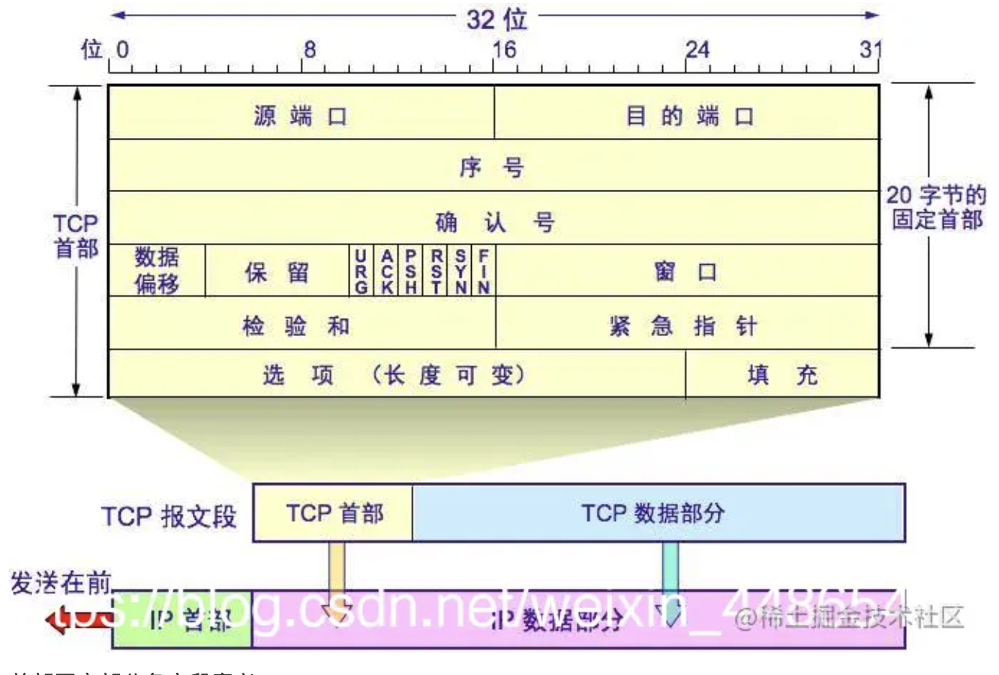
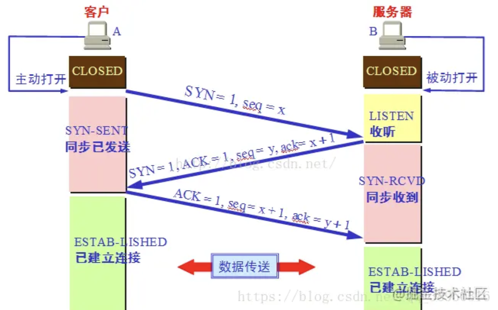

# 计算机网络

## ISO七层模型

* 应用层: 应用进程间的通信和交互的规则
  > 对于不同的网络应用需要不同的应用层协议. 例如: DNS,HTTP,SMTP. 应用层的交互数据单元叫报文.  -- **协议**
* 表示层
* 会话层
* 传输层
  > 负责向两台主机进程之间的通信提供通用的数据传输服务, 应用进程利用该服务传送应用报文.  -- **服务**
* 网络层
  > 在计算机网络中进行通信的两个计算机之间可能会经过很多个数据链路，也可能还要经过很多通信子网。网络层的任务就是选择合适的网间路由和交换结点， 确保数据及时传送。在发送数据时，网络层把运输层产生的报文段或用户数据报封装成分组和包进行传送。在 TCP / IP 体系结构中，由于网络层使用 IP 协议，因此分组也叫 IP 数据报，简称数据报。
* 数据链路层
  > 两台主机之间的数据传输，总是在一段一段的链路上传送的，这就需要使用专门的链路层的协议。在两个相邻节点之间传送数据时，数据链路层将网络层交下来的 IP 数据报组装成帧，在两个相邻节点间的链路上传送帧。每一帧包括数据和必要的控制信息
* 物理层
  > 在物理层上所传送的数据单位是比特。物理层（physical layer）的作用是实现相邻计算机节点之间比特流的透明传送，尽可能屏蔽掉具体传输介质和物理设备的差异。使其上面的数据链路层不必考虑网络的具体传输介质是什么。

## 计算机五层网络体系网络协议有哪些

* 应用层: HTTP,FTP(文本传输协议),SMTP(简单邮件传输协议),DNS,SSH(安全外壳协议),DHCP,TELNET(远程登录协议)
* 传输层: TCP(传输控制协议),UDP(用户传输报文协议)
* 网络层: IP(网际协议),ARP(地址转换协议),RARP,ICMP,IGMP,RIP,OSPF,BGP
* 数据链路层: ARQ,CSMA/CD,PPP
* 物理层: 中继器,集线器,网线,HUB

## TCP 报文段首部格式

> 1.长度：从0-31，所以每一行为32位，占4个字节。至少占5行，TCP报头最小20个字节，最大60字节。  
2.16位源端口号：发送端端口号  
3.16位目的端口号：接收端端口号  
4.32位序号：即编号，初始值：第一个数据在第一次交互时由系统随机生成。  
序号值如何变化？第一个为随机值，第二个就是发送的数据在整个字节流中的偏移量 + 第一次生成的值
数据值也是从小到达排列：可以保证数据不乱序
如图所示：假设由100个字节数据要发送，初始值为2000，初始值+偏移量即为下一个的序号值。
5.32位确认号：数据发送出去接收端接收后，接收端给发送端回馈确认机制。  
若接收端接收到2000，则回复2001。
确认号还能够处理重复的报文段，一旦接收到相同的序号就丢弃
6.4位头部长度：15个4字节，最多60个字节。  
对于底层而言，控制协议是一堆数据，发送的还是一堆数据，接收端接收到后如何确定哪些是头部哪些是所携带的数据？
4位头部长度可确认，前20个字节为报头后面是携带的数据。若选项部分携带4字节，则前24字节为头部后面为携带数据。
7.6位保留：占6位，保留为今后使用，目前应设置为0  
8.控制位UGR、ACK、PSH、RST、SYN、FIN：
紧急UGR:当UGR置1时，发送应用进程就告诉发送方的TCP有紧急数据要传送。于是发送方的TCP就把紧急数据插入到本报文段数据的最前面，而在紧急数据后面的数据仍是普通数据。
确认ACK:确认报文段，仅当ACK=1时确认号字段才有效。当ACK=0时，确认号无效。
推送PSH:当两个应用进程进行交互式的通信时，有时在一端的应用进程希望在键入一个命令后立即就能够收到对方响应。在这种情况下，TCP可以使用PSUH(推送操作)。这时，发送方TCP把PSH置1，并立即创建一个报文段发送出去。接收方TCP收到PSH=1的报文段，就尽快(推送)交付给接收应用进程，而不在等整个缓存都填满了再向上交付。
复位RST:当RST=1时，表明TCP连接出现了严重差错，必须释放连接，然后重新建立新运输连接。**RST=1还可以用来拒接一个非法报文段或拒绝打开一个连接。
同步SYN:在建立连接时用来同步序号。当SYN=1，ACK=0时，表明这是一个连接请求报文段；对方若同意连接，则应在相应的报文段中使SYN=1,ACK=1。因此SYN置1就表示这是一个连接请求或连接接受报文段。
终止FIN：用来释放一个连接，当FIN=1时，表明此报文段的发送方数据已经发送完毕，并要求释放运输连接。  
9.16位窗口大小：流量管控,窗口值是[0~216-1]之间的整数。窗口值告诉了对方，从本报文段的确认号算起，允许对方发送的数据量。
心跳包机制：
10.16位校验和：CRC循环冗余检测算法  
11.16位紧急指针：TCP的紧急指针是发送端向接收端发送紧急数据的方法。紧急指针是一个正的偏移量。它和序号字段的值相加表示最后一个紧急数据的下一字节的序号。这个字段是紧急指针相对当前序号的偏移，不妨称之为紧急偏移。  
12.选项部分：长度可变，最小0字节，最长达40字节。当没有使用选项部分时，TCP的首部为20字节。
MTU限制：以太网为例1500字节，IP头部20个字节，TCP头部和数据加起来共1480个字节，又因为TCP头部20个字节，所以它所能携带的上层数据为1460个字节。

## TCP三次握手

> 最初客户端和服务端都处于 CLOSED(关闭) 状态。
A（Client） 主动打开连接，B（Server） 被动打开连接。一开始，B 的 TCP 服务器进程首先创建传输控制块TCB，准备接受客户端进程的连接请求。然后服务端进程就处于 LISTEN(监听) 状态，等待客户端的连接请求。如有，立即作出响应。  
第一次握手：A 的 TCP 客户端进程也是首先创建传输控制块 TCB。然后，在打算建立 TCP 连接时，向 B 发出连接请求报文段，这时首部中的同步位 SYN=1，同时选择一个初始序号 seq = x。TCP 规定，SYN 报文段（即 SYN = 1 的报文段）不能携带数据，但要消耗掉一个序号。这时，TCP 客户进程进入 SYN-SENT（同步已发送）状态。  
第二次握手：B 收到连接请求报文后，如果同意建立连接，则向 A 发送确认。在确认报文段中应把 SYN 位和 ACK 位都置 1，确认号是 ack = x + 1，同时也为自己选择一个初始序号 seq = y。请注意，这个报文段也不能携带数据，但同样要消耗掉一个序号。这时 TCP 服务端进程进入 SYN-RCVD（同步收到）状态。  
第三次握手：TCP 客户进程收到 B 的确认后，还要向 B 给出确认。确认报文段的 ACK 置 1，确认号 ack = y +  1，而自己的序号 seq = x + 1。这时 ACK 报文段可以携带数据。但如果不携带数据则不消耗序号，这种情况下，下一个数据报文段的序号仍是 seq = x + 1。这时，TCP 连接已经建立，A 进入 ESTABLISHED（已建立连接）状态。