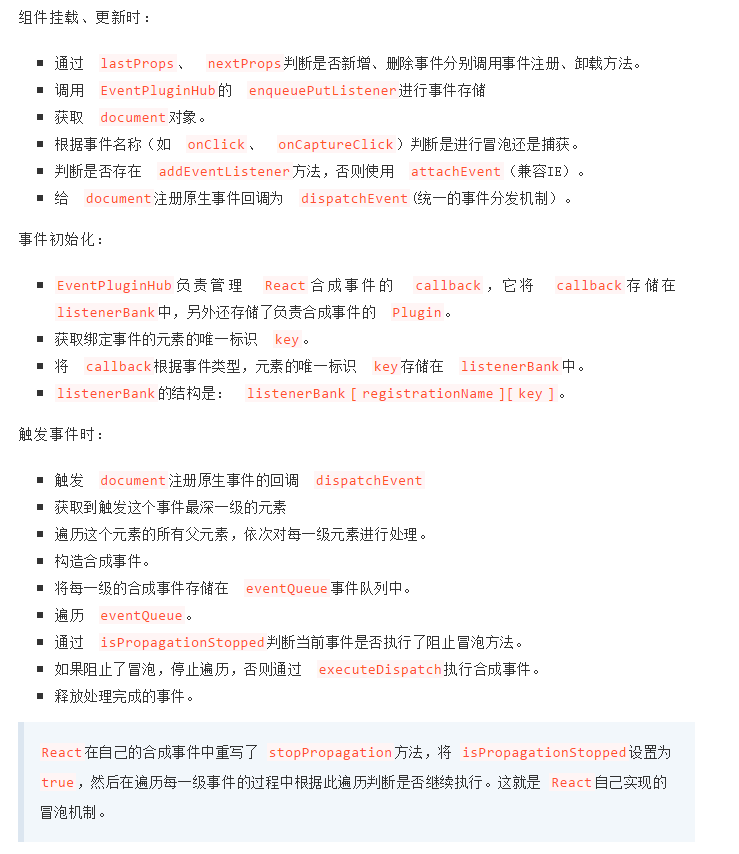

## Redux

* Store: 保存数据的地方, 整个应用只能有一个Store, Redux提供createStore用来生成Store
* State: Store对象包含所有数据, 如果想要得到某个时点的数据, 就要对Store生成快照, 这个时点的数据集合就叫做State. 当前时刻State可以通过 store.getState()得到
* Action: Action是一个对象, type属性是必须的, 表示Action的名称, Action描述当前发生的事情, 改变State的唯一办法,就是使用Action
* store.dispatch(): 是view发出Action的唯一方法, store.dispatch 接受一个Action参数, 将他发送出去
* Reducer: Store收到Action以后, 必须给出一个新的state,这种State的计算过程就叫做Reducer, Reducer是一个函数, 接受Action和当前state作为参数, 返回一个新的state。在createStore函数中传入Reducer作为参数, 生成一个新的Store,每当store.dispatch发过来Action时, 就会自动调用Reducer,得到新的state
* store.subscribe(): Store允许使用store.subscribe()方法设置监听, 一旦State发生变化, 自动执行这个函数, 接受一个监听函数作为参数, 并返回一个函数, 调用可以解除监听
* combineReducers: 用于Reducer的拆分, 只要定义各个子Reducer函数. 然后使用这个函数将他们合并为一个大的Reducer

## redux-saga

redux-saga 是一个用于管理应用程序副作用的库, redux-saga是一个redux中间件, 意味着这个县城可以通过正常的redux action从主应用程序启动, 暂停, 和取消,他能完整的访问state,也可以dispatch redux action,  redux-saga使用了es6的Generator功能
* 执行过程: 
	* 通过takeEvery(或takeLatest)监听某个action. 一旦发起action, 则会执行takeEvery第二个参数传入的相关异步操作(异步过程中通过调用call等函数).然后通过put函数通知store结果.

## Fiber(核心调度算法)

* Fiber是线程的颗粒化的一个概念. 一个线程可以包含多个Fiber
* Fiber是大量的同步计算可以被拆解,异步化 使浏览器主线程得以调控, 包含以下权限
	* 暂停运行任务
	* 恢复并继续执行任务
	* 给不同的任务分配不同的优先级
* 原理: 
	* 将一个state更新需要执行的同步任务拆分成一个Fiber任务队列
	* 在任务队列中选出优先级高的Fiber执行, 如果执行时间超过了deathLine,则设置为pending状态挂机
	* 一个Fiber执行结束或挂起, 或调用基于 requestIdleCallback/requestAnimationFrame实现的调度器,返回一个新的Fiber任务队列继续进行上述过程
	* requestIdleCallback会让一个低优先级的任务在空闲期被调用，而requestAnimationFrame会让一个高优先级的任务在下一个栈帧被调用，从而保证了主线程按照优先级执行Fiber单元。
	* 由此我们可以看出Fiber任务的优先级顺序为：
		* 文本框输入 > 本次调度结束需完成的任务 > 动画过渡 > 交互反馈 > 数据更新 > 不会显示但以防将来会显示的任务

## virtual DOM

virtual dom 是一个轻量级的JavaScript对象, 他最初只是real DOM的副本, 是一个节点树, 将元素,及他们的属性和内容最为对象及其属性, React的渲染函数从React组件中创建一个节点树, 然后它响应数据模型中的变化来更新该树, 该变化是由用户或系统完成的各种动作引起的.
* virtual DOM 工作过程
	* 每当底层数据发生改变时, 整个UI都将在Virtual DOM 描述中重新渲染. 
	* 然后计算Z之前DOM表示与新表示之间的差异(diff)
	* 完成计算后, 将只用实际更改的内容更新real DOM
* 虚拟dom比普通dom更快吗
	* 如果是首次渲染, 虚拟dom不具有任何优势, 甚至要进行更多的计算, 消耗更多的内存, 
	* 虚拟dom的优势在于 react diff算法和批处理策略, react在页面更新之前, 计算好如何进行更新和渲染, 这个点其实是所谓的虚拟dom提升性能的点.
	* 虚拟dom并不是比dom操作更快, 而是在重复渲染的时候帮助计算如何更高效的更新

## render()的作用

每个组件强制要求必须有一个render(), 他返回一个React元素, 是原生dom组件的表示, 如果要渲染多个HTML元素, 则必须将他们在一个封闭标记内, 此函数必须保持纯净

## react中key的作用
* react利用key来识别组件, 它是一种身份标识, 每个key对应一个组件, 相同的key, react会认为是同一个组件, 这样后续相同的key对应的组件都不会被创建
* key属性是添加到自定义的子组件上，而不是子组件内部的顶层的组件上。
* key值的唯一是有范围的，即在数组生成的同级同类型的组件上要保持唯一，而不是所有组件的key都要保持唯一
* react利用key来区分组件的，相同的key表示同一个组件，react不会重新销毁创建组件实例，只可能更新；key不同，react会销毁已有的组件实例，重新创建组件新的实例。

## HOC, render props, hook

* HOC: 创建一个函数, 该函数接收一个组件作为输入, 基于该组件返回了一个不同的组件
	* 优点: 不会影响内层组件的状态, 降低了耦合度
	* 缺点: 固定的props可能会被覆盖, 无法清晰地标识数据的来源
* render props:  接收一个外部传递进来的props属性,  将内部的state作为参数传递给调用组件的props属性方法
	* 缺点:无法在return语句外访问数据, 容易导致嵌套地域
* 应用场景: 
	* 日志打点,
	* 权限控制
	* 双向绑定
	* 表单校验
* hook
	* hook可以重命名
	* hook会清晰的标注来源
	* hook可以在return外使用
	* hook不会嵌套

## react diff

* 原理: 树是递归的数据结构, 时间复杂度,O(n^3), react只比较同一层, 一旦不一样, 删除, 这样每一个节点只会比较一次, 所以算法时间复杂度变成O(n), 对于同一层的一组子节点, 他们有可能顺序发生改变, 但是内容没有变化, react根据key值来进行区分,一旦key值相同, 就直接返回之前的组件, 不重新创建,

## setState的同步与异步
取决于是在react批处理之前还是之后, 之前是异步, 之后是同步

* setState在原生事件和setTimeout中都是同步的, 在合成事件和钩子函数 中是异步的,
* 在setState中, 会根据一个isBatchingUpdates判断是直接更新还是稍后更新, 他的默认值是false, 但是React在调用事件处理函数之前会先调用batchedUpdates这个函数, batchedUpdates函数回将isBatchingUpdates设置为true, 因此由react控制的事件处理过程就变成了异步,(批量更新)

## 受控组件和非受控组件

* 受控组件: 受状态控制,  必须有onChange方法, 可以赋予默认值, 状态改变的时候会被写进组件的state中
* 非受控组件: 不受状态控制. 组件没有value prop, 通常需要通过ref来访问底层DOM

## react生命周期. 

* 初始化阶段: constructor, getDefaultProps, getInitialState
* 挂载阶段: componentWillMount, render, componentDidMount
* 更新阶段: componentWillReceiveProps, shouldComponentUpdate, componentWillUpdate, render, componentDidUpdate, 
* 卸载阶段: componentWillUnmount

## react的事件机制

* React事件没有绑定在真实的Dom节点上, 而是通过事件代理, 在最外层的document上对事件进行统一分发

## React事件要绑定this

* React在documen上进行统一的事件分发, dispatchEvent通过循环调用所有层级的事件来模拟事件冒泡和捕获, 在react中. 当某一事件处理函数要调用时, 将调用invokeGuardedCallback方法, 在内部事件处理函数是直接调用的, 并没有指定调用的组件, 所以不进行手动绑定的情况下直接获取到的this是不准确的, 所以需要手动将当前组件绑定到this上

## 原生事件与react事件

* React事件使用驼峰命名, 而不是全小写
* 通过JSX, 你传递一个函数作为事件处理程序, 而不是一个字符串
* 在react中不能通过返回false来阻止默认行为, 必须明确调用preventDefault

## react的合成事件(SyntheticEvent)

* react根据W3C规范定义了每个事件处理函数的参数, 即合成事件
* 事件处理程序将传递SyntheticEvent的实例, 这是一个跨浏览器原生事件包装器, 它具有与浏览器原生事件相同的接口, 包括stopPropagetion, preventDefault, 在所有浏览器中他们的工作方式都相同.,  react合成的SyntheticEvent,采用了事件池, 节省内存, 

## react和原生事件的执行顺序

* react的事件都是通过document进行统一分发, 当真实dom触发事件后冒泡到document后才会对react事件进行处理,
* 原生的事件会先执行, 然后执行react的合成事件, 最后执行真正在document挂载的事件, 
* react事件和原生事件最好不混用, 原生事件如果执行了stopPropagation方法, 则会导致其他react事件失效, 因为所有元素的事件将无法冒泡到document上, 导致所有react事件都会无法触发

## react组件渲染流程

* 使用React.createElement或JSX编写React组件, 实际上jsx代码最终都会转换成React.createElement, Babel帮助完成转换
* createElement函数对key和ref等特殊的props进行处理, 并获取defaultProps对默认props赋值, 并对children节点进行处理, 最终构成一个ReactElement对象(虚拟dom)
* ReactDom.render()将生成的虚拟dom渲染到指定的容器上, 其中采用了批处理, 事务等机制,并且对特定浏览器进行了性能优化, 最终转换成真实dom

## 代码一定需要引入react

* jsx只是为React.createElement(component, props, ...children)方法提供的语法糖,所有jsx代码最后都会转换成React.CreateElement,babel进行转译,

## React组件首字母都需要大写

* babel在编译时会判断jsx组件的首字母, 小写时会被认定为原生dom标签, createElement第一个变量会被编译为字符串, 大写时被认定为自定义组件, createElement的第一个变量编译为对象

## react渲染真实dom做了哪些性能优化 

* 在IE, Edge中, 一个一个插入子孙节点, 效率高于插入一整个序列化的节点树
* react通过lazyTree,在IE,Edge进行单个节点依次渲染节点, 而在其他浏览器则首先将整个大的DOM结构建好,整体插入容器

## 为什么hook只能在顶层调用
我们可以在组件中使用多个state Hook或 Effect Hook, 但是React如何知道state对应哪个useState? React是根据Hook的调用顺序来追踪state的. Hook在每次渲染中的调用顺序保持相同, React就能正确地将内部state和对应的Hook进行关联. 
