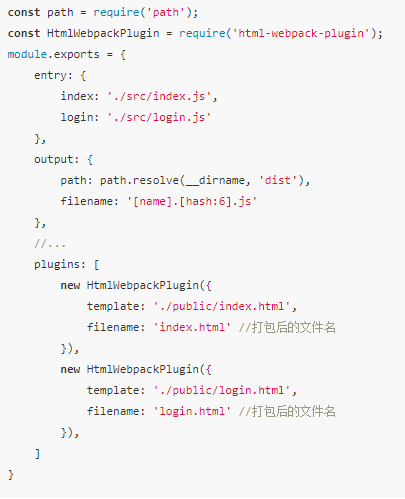

[参考1](https://juejin.im/post/5e5c65fc6fb9a07cd00d8838)
[参考2](https://juejin.im/post/5e6518946fb9a07c820fbaaf?utm_source=gold_browser_extension)
# Webpack    
webpack是一个现代JavaScript应用程序的静态模块打包器, 当webpack处理应用程序时, 会递归构建一个依赖关系图, 其中包含应用程序需要的每一个模块, 然后将这些模块打包成一个或多个bundle.
## 核心概念

* entry: 入口
* output: 输出
* loader: 模块转换器, 用于把模块原内容按照需求转换成新内容,执行顺序从右向左
* plugin: 扩展插件, 在webpack构建流程中的特定时机注入扩展逻辑来改变构建结果

## 配置: 

* 在webpack.config.js进行配置, module.exports ={entry: '', output: '', mode: 'development'}
* loader需要配置在module.rules中, rules输一个数组,  格式: {test: /\.js$/, use: '', include: //, exclude:/node_modules/}
	* use字段几种写法
		* 字符串, use: 'babel-loader'
		* 数组, use: ['style-loader', 'css-loader']
		* 对象: use : {loader: 'babel-loader', options:{presets: ["@babel/preset-env"]}}
* mode配置项, 告知webpack使用相应模式的内置优化,支持两个配置, development, production, 
	* development:  将 process.env.NODE_ENV 的值设置为 development，启用 NamedChunksPlugin 和 NamedModulesPlugin
	* production:   将 process.env.NODE_ENV 的值设置为 production，启用 FlagDependencyUsagePlugin, FlagIncludedChunksPlugin, ModuleConcatenationPlugin, NoEmitOnErrorsPlugin, OccurrenceOrderPlugin, SideEffectsFlagPlugin 和 UglifyJsPlugi
* devtool可以帮助我们将编译后的代码映射回原始源代码, 生产环境可以使用none或者source-map
* 处理css等样式文件
	* 借助loader,  css需要 style-loader, css-loader, postcss-loader,  less,scss需要 less-loader, sass-loader
	* style-loader 动态创建style标签. 将css插入到head中.
	* css-loader负责处理@import等语句
	* postcss-loader和autoprefixer自动生成浏览器兼容性前缀
	* less-loader,scss-loader负责解析.less .scss文件, 将其转化为css
* 图片/字体等静态文件处理
	* 借助url-loader或者file-loader来处理本地的资源文件
	* url-loader可以指定文件大小的限制, 小于限制转换为base64, 超过的 拷贝到dist目录
	* 资源转换为base64可以减少网络请求次数, 但是base64数据较大, 如果过多会导致加载变慢
* 出口配置
	* output: {path: path.resolve(__dirname, 'dist'), filename: 'bundle.[hash:6].js', publicPath: '/'}
* 打包前清空dist目录
	* 借助clean-webpack-plugin插件
	* dist中某个目录不清除, 参数: cleanOnceBeforeBuildPatterns
* 静态资源拷贝
	* 有时候需要使用本地的js,css等文件, 但是不需要webpack编译,可以通过CopyWebpackPlugin拷贝到编译目录下
* 全局变量
	* ProvidePlugin作用就是不需要import或require就可以在项目中到处使用
	* ProvidePlugin是webpack的内置插件
	* 例: new Webpack.ProvidePlugin({ React: 'react' , Vue: ['vue/dist/vue.esm.js', 'default']})  
	* 注: 通过export default到处的 需要加 'default',  module.exports 不要写 'default'
* 按需加载
	* 需要@babel/plugin-syntax-dynamic-import插件支持, 在 @babel/preset-env 内置
	* 使用 import('./handle') 可以实现按需加载
* 热更新
	* devServer : { hot: true }
	* 插件:  webpack.HotModuleReplacementPlugin
	* 避免整个页面刷新,  入口文件中加入 if( module && module.hot ) { module.hot.accept() }
* 多页应用打包
	*  HtmlWebpackPlugin 提供了一个 chunks 的参数，可以接受一个数组，配置此参数仅会将数组中指定的js引入到html文件中，此外，如果你需要引入多个JS文件，仅有少数不想引入，还可以指定 excludeChunks 参数，它接受一个数组。  
    
* resolve 配置
	* modules  配置webpack去哪些目录下寻找第三方模块, 默认只会去node_modules寻找
	* alias: 别名
	* extensions:  适配多端的项目中, extensions: ['web.js',  '.js'] 在缺省文件后缀时, 会自动带上extensions中配置的后缀, 按顺序左 → 右
	* enforceExtension: true  导入语句不能缺省文件后缀
	* mainFields
* 区分不同环境
    * 创建多个配置文件: webpack.base.js, webpack.dev.js, webpack.prod.js
	* webpack-merge 合并配置文件
* webpack.DefinePlugin: 定义全局环境变量
* 解决跨域
	* 配置代理
    ```js
    devServer: {
        proxy: {
            '/api': {
                target: '',
                pathRewrite: {
                    '/api': ''
                }
            }
        }
    }
    ```
* 模拟数据
	* mocker-api

## 优化

* 通过exclude, include排除或指定转译的文件
	* exclude优先级高于include,  使用绝对路径数组, 
* 在一些性能开销大的loader之前添加cache-loader可以将结果缓存在磁盘中. 
* 通过HappyPack能够让Webpack做到这点. 
	* 把任务分解给多个子进程去并发的执行, 子进程处理完后再把结果发送给主进程

## 特色

* code splitting(可以自动完成) (根据代码的分割对文件进行分块)
* loader 可以处理各种类型的静态文件, 并且支持串联操作, 
* webpack是一commonJS的形式来书写脚本的, 但对AMD/CMD的支持也很全面, 方便旧项目进行代码迁移, 
* webpack机油requireJS和browserify的功能,
* 对js, css, 图片等资源文件都支持打包, 
* 串联式模块加载器以及插件机制, 让其具有更好的灵活性和扩展性
* 独立的配置文件
* 将代码切割成不同chunk, 实现按需加载
* webpack使用异步IO并具有多级缓存, 是的webpack很快且增量编译更快

## webpack的理解,优点,原理,打包的过程

* 优点:
	* 依赖管理, 方便引用第三方模块, 让模块更容易复用, 避免全局注入导致的冲突.避免重复加载或加载不需要的模块
	* 合并代码: 把各个分散的模块集中打包成大文件, 减少HTTP的请求连接数, 配合 UglifyJS 可以减少, 优化代码体积
* 原理: 
	* 一切皆为模块, 由于webpack并不支持除 .js意外的文件, 从而需要使用loader转换成wenpack支持的模块, Plugin用于扩展webpack的功能, 在webpack构建生命周期的过程在合适的时机做了合适的事情
* 过程: 
	* 解析配置参数, 合并shell传入和webpack.config.js文件的配置信息, 输出最终的配置信息
	* 注册配置中的插件, 好让插件监听webpack构建生命周期中的事件节点, 做出对应的反应
	* 解析配置文件中的entry入口文件, 并找出每个文件依赖的文件, 递归下去
	* 在递归每个文件的过程中. 根据文件类型和配置文件中loader找出相对应的loader对文件进行转换
	* 递归结束之后得到每个文件最终的结果, 根据entry配置生成代码chunk
	* 输出所有chunk到文件系统


## 实现原理

* 分析依赖: 从一个入口文件开始分析, 当我们把一个入口的文件路径传入, webpack就会通过这个文件路径读取文件信息, 然后把读取到的信息转成AST, 就是把一个js文件里面的内容存到某种数据结构里, 里面包括各种信息, 其中就有当前模块依赖了哪些模块, 通过传文件路径能返回文件信息的函数叫 createAsset
*  createAsset返回什么 ?  包括模块ID, 文件路径, 依赖数组, code, 循环调用, 得到所有依赖, 想得到全部依赖信息需要调用createGraph这个函数. 它会进行广度遍历
* 我们现在已经能拿到每个模块之前的依赖关系，我们再通过调用bundle函数，其实bundle函数就是返回我们构造的字符串，拿到字符串，我们把字符串导出成bundle.js

## webpack常见loader

* raw-loader：加载文件原始内容
* file-loader： 把文件输出到一个文件夹，通过相对URL去引用输出的文件（处理图片和字体）
* url-loader： 也file-loader类似，不同的是在小于阈值时，返回文件base64形式编码
* source-map-loader： 加载额外的sourceMap文件，方便断电调试
* image-loader： 加载并且压缩图片文件
* json-loader： 加载json文件
* babel-loader： 将es6转换成es5
* ts-loader： 将typescript转为JavaScript
* awesome-typescript-loader： 功能同ts-loader，性能更优
* sass-loader： 将scss、sass代码转换成css
* css-loader：加载css，支持模块化，压缩，文件导入等特性
* style-loader：把css代码注入到JavaScript，通过dom操作去加载css
* postcss-loader： 扩展css语法，自动补齐前缀
* eslint-loader：通过eslint检查JavaScript代码
* tslint-loader： 通过tslint检查代码
* mocha-loader加载Mocha测试用例的代码
* coverjs-loader：计算测试覆盖率
* vue-loader：加载vue单文件组件
* i18n-loader：国际化

## 常见plugin

* define-plugin： 定义环境变量
* ignore-plugin：忽略部分文件
* html-webpack-plugin：简化HTML文件创建
* web-webpack-plugin：输出Html，比html-wepack-plugin好用
* terser-webpack-plugin：支持es6压缩
* webpack-parallel-uglify-plugin：多进程执行代码压缩，提升构建速度
* mini-css-extract-plugin：分离样式，css提取为独立文件，支持按需加载
* serviceworker-webpack-plugin：为网页应用增加离线缓存功能
* clean-webpack-plugin：目录清理
* speed-measure-webpack-plugin：可以看到每个loader和plugin执行耗时
* webpack-bundle-analyzer：可视化webpack输出文件的体积
* happypack：优化代码打包速度，多进程

## loader于plugin的区别

* loader本质上是一个函数，在函数中对接受到的内容进行转换， 返回转换后的结果，loader是翻译官，转化为webpack可识别的JavaScript，对其他资源预处理
* plugin是插件，插件可以扩展webpack的功能，在webpack的运行周期中会广播出许多事件，plugin监听这些事件，在合适的时机通过webpack提供API改变输出结果。

## webpack构建流程

* 初始化参数-->开始编译-->确定入口-->编译模块-->完成模块编译-->输出资源-->输出完成
* webpack会在特定的时间点广播出特定的事件,提供给plugin监听

## 提高效率的插件

* webpack-dashboard:友好的展示相关打包信息
* webpack-merge： 提供公共配置，减少重复配置
* hotModuleReplacementPlugin： 模块热替换

## 热更新原理：

* HMR的核心就是客户端从服务端拉去更新后的文件（chunk diff），实际上WDS与浏览器之间维护了一个Websocker，当本地资源发生变化时，WDS会向浏览器推送更新，并带上构建时的hash，让客户端与上一次资源进行对比，对比出差异之后会发送Ajax请求获取更改内容，这样客户端就可以再借助这些信息继续向WDS发起jsonp请求获取该chunk的增量更新

## 代码分割：

* 在源代码直接上线和打包成唯一脚本之间的一种状态，“用可接受的服务器心梗压力增加来换取更好的用户体验”
* 源代码直接上线：http请求多，性能开销大
* 唯一脚本，服务器压力小，页面空白期长，用户体验不好


## Bable
* babel 是一个JavaScript编译器, 用于将ECMAScript 2015+版本的代码转换为向后兼容的JavaScript语法, 以便能够运行在当前版本和旧版本的浏览器或其他环境中
	* 语法转换
	* 通过Polyfill的方式在目标环境中添加缺失的特性
	* JS源码转换
* 原理: 核心是AST,  首先将源码转成抽象语法树, 然后对语法树进行处理生成新的语法树, 最后将新语法树生成新的js代码, 整个编译过程分为3个阶段,  parsing(解析) --> transforming(转换)-->generating(生成), 都是围绕着AST去做文章, 
* 使用: 
	* @babel/cli
		* @babel/cli 是babel提供的内建命令行工具
	* @babel/core
* 配置: 配置文件的四种形式
	* babel.config.js   在根目录创建
	* .babelrc
	* .babelrc.js    module.exports = { presets: [], plugins: {} }
	* package.json中添加 "babel" 属性
* 插件: 插件是用来定义如何转换代码的, 在babel的配置项中填写需要使用的插件名称. babel在编译的时候就会去加载node_modules中的npm包, 然后编译插件对应的语法
	* 插件执行顺序:  插件在预设前运行, 插件的执行顺序是从左往右执行的, 
	* 插件传参: 参数是由插件名称和参数对象组成的一个数组
* 预设: 是一堆插件的组合, 从而达到某种转译的能力, 比如react中使用到的@babel/preset-react是由 @babel/plugin-syntax-jsx, @babel/plugin-transform-react-jsx, @babel/plugin-transform-react-display-name 组成
	* 预设的执行顺序是 从右往左

